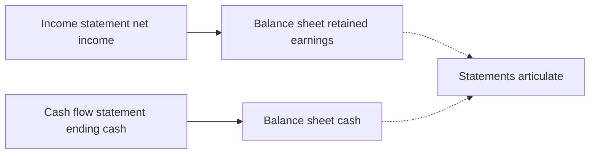
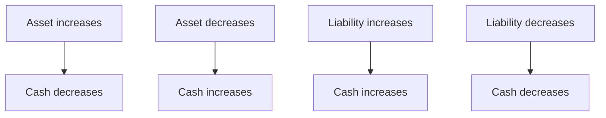

# Lecture 2 — How the Statements Link

> **Duration:** ~2 hours. **Outcome:** You can prove, with SQL, that Crunch Machine Co.'s three statements tie together — net income flowing into retained earnings, cash-flow-statement ending cash matching the balance sheet, and both current-year plugs coming out right — and you understand *why* a financial model that doesn't tie out is a broken model, full stop.

## 1. "Articulation" — the word for what you're about to prove

Accountants have a specific word for the fact that the three statements connect: **articulation**. A set of financial statements is "articulated" when every number that should appear in two places actually does — consistently, with no fudge factor. This isn't a nice-to-have. It's the entire reason double-entry bookkeeping exists, and it's the fastest way to catch an error in *any* financial model, real or one you build yourself: if it doesn't articulate, something is wrong, and you find out before anyone believes a wrong number.

There are two articulation checks you'll run constantly, this week and for the rest of your finance career:

1. **Net income → retained earnings.** The income statement's bottom line has to explain the change in the balance sheet's retained-earnings line.
2. **Cash-flow statement → balance sheet.** The cash-flow statement's ending cash has to equal the balance sheet's cash.


*The two articulation checks that must tie the three statements together.*

## 2. Check 1 — net income flows into retained earnings

Retained earnings is the balance sheet's memory of every dollar of profit the company has ever kept. Each year, exactly one equation governs how it changes:

```
Retained earnings (end)  =  Retained earnings (start)  +  Net income  −  Dividends paid
```

Nothing else can move retained earnings (barring rare items like stock buybacks routed through retained earnings, which don't happen in Crunch Machine Co.'s statements). Walk it for FY2022:

```
RE start (FY2021 ending) =  23,850
+ Net income (FY2022)     =   4,882
− Dividends paid (FY2022) =  (5,582)
= RE end (FY2022 ending)  =  23,150
```

Check that against the balance sheet: `retained_earnings` for fiscal_year 2022 is indeed `23150`. It has to be — there's no other place for a dollar of profit to go except out the door as a dividend or into retained earnings.

Prove it for every year at once in SQL, using `LAG()` to pull each year's prior-year retained earnings into the same row:

```sql
WITH re_check AS (
    SELECT
        bs.fiscal_year,
        LAG(bs.retained_earnings) OVER (ORDER BY bs.fiscal_year) AS re_start,
        cf.net_income,
        cf.dividends_paid,
        bs.retained_earnings AS re_end_actual
    FROM balance_sheet bs
    JOIN cash_flow_statement cf ON cf.fiscal_year = bs.fiscal_year
)
SELECT
    fiscal_year,
    re_start,
    net_income,
    dividends_paid,
    re_start + net_income + dividends_paid AS re_end_computed,
    re_end_actual,
    (re_start + net_income + dividends_paid) = re_end_actual AS ties_out
FROM re_check
WHERE re_start IS NOT NULL
ORDER BY fiscal_year;
```

Note `dividends_paid` is already stored as a **negative** number in `cash_flow_statement` (the sign convention this course uses throughout — negative means cash left the company), so the formula is a straight addition: `re_start + net_income + dividends_paid`. Run this query. Every row should show `ties_out = true` (or `1` on SQLite). If even one row is `false`, you have a real error to hunt down — that's exactly the muscle Exercise 2 drills.

## 3. Check 2 — cash-flow ending cash meets the balance sheet

The second articulation check is more direct. The cash-flow statement's own arithmetic is:

```
Cash (end)  =  Cash (start)  +  CFO  +  CFI  +  CFF
```

and separately, whatever that `Cash (end)` figure comes out to **must equal** the `cash` line on that same year's balance sheet. Two independently-built statements, one number that has to match:

```sql
SELECT
    cf.fiscal_year,
    cf.cash_beginning,
    cf.cfo, cf.cfi, cf.cff,
    cf.cfo + cf.cfi + cf.cff AS net_change_computed,
    cf.net_change_in_cash AS net_change_reported,
    cf.cash_ending,
    bs.cash AS balance_sheet_cash,
    cf.cash_ending = bs.cash AS ties_out
FROM cash_flow_statement cf
JOIN balance_sheet bs ON bs.fiscal_year = cf.fiscal_year
ORDER BY cf.fiscal_year;
```

Run it. `ties_out` should be `true` on every row. This is not a coincidence built into the seed data for your convenience — it is a **mathematical requirement** of correctly prepared financial statements. Any real company's filings will tie out exactly the same way (down to rounding). If you ever build a financial model — in this course or in a job — and this check fails, stop and find the bug before you trust a single ratio downstream.

## 4. Where the working-capital adjustments actually come from

Section 2's `re_check` query treated net income and dividends as given. But CFO itself — the `6,640` for FY2021 — isn't just handed to you either; it's *built* from the balance sheet's year-over-year changes. This is the second half of articulation: the cash-flow statement's operating section is derived by comparing **this year's balance sheet to last year's**.

```sql
WITH bs_changes AS (
    SELECT
        fiscal_year,
        accounts_receivable - LAG(accounts_receivable) OVER (ORDER BY fiscal_year) AS ar_change,
        inventory          - LAG(inventory)          OVER (ORDER BY fiscal_year) AS inv_change,
        accounts_payable   - LAG(accounts_payable)   OVER (ORDER BY fiscal_year) AS ap_change
    FROM balance_sheet
)
SELECT
    b.fiscal_year,
    b.ar_change,   -b.ar_change  AS cf_change_ar_expected,
    b.inv_change, -b.inv_change  AS cf_change_inventory_expected,
    b.ap_change,   b.ap_change   AS cf_change_ap_expected,
    cf.change_ar, cf.change_inventory, cf.change_ap
FROM bs_changes b
JOIN cash_flow_statement cf ON cf.fiscal_year = b.fiscal_year
WHERE b.ar_change IS NOT NULL
ORDER BY b.fiscal_year;
```

Notice the sign flip: when AR *increases* year over year (`ar_change` is positive), the cash-flow line is *negative* — an increase in a customer's unpaid balance is a use of cash, because it's revenue you booked but haven't collected. When AP *increases* (positive `ap_change`), the cash-flow line is also *positive* — an increase in what you owe suppliers is a source of cash, because you're holding onto your own cash longer before paying it out. Inventory behaves like AR (an asset — increase is a cash use); AP behaves oppositely (a liability — increase is a cash source). This asset-vs-liability sign flip is the single most common place beginners get the cash-flow statement backwards. Say it out loud until it's automatic: **assets up, cash down; liabilities up, cash up.**


*The asset-versus-liability sign-flip rule for cash-flow adjustments.*

## 5. Why the model must tie out — the practical case

It's tempting to treat "does it tie out" as a formality. It isn't, for three concrete reasons:

**It's the cheapest error-detection you'll ever have.** A financial model with hundreds of formulas has hundreds of places to make a typo. Articulation checks collapse all of that into two boolean columns: `true` or `false`. If `false`, you know *something* is wrong before you've wasted an afternoon trusting a ratio built on broken data.

**Non-articulation hides real problems, not just typos.** If a real company's own reported cash-flow statement doesn't tie to its own balance sheet (it happens — restatements, errors, sometimes fraud), that's material information. Enron's later statements had articulation problems long before the collapse became public. A model — or a real filing — that won't tie out is telling you something is broken in the underlying accounting, not just in your spreadsheet math.

**Every downstream ratio depends on it.** Every ratio you'll compute in Lecture 3 pulls numbers from two or three of these statements at once (current ratio needs the balance sheet; interest coverage needs the income statement; free cash flow needs the cash-flow statement and sometimes both others). If the statements don't agree with each other, the ratios you build on top are meaningless — garbage in, garbage out, just one layer removed from the raw numbers.

## 6. A single query that runs both checks at once

Put it together into one query you could hand to anyone auditing this model:

```sql
WITH re_check AS (
    SELECT
        bs.fiscal_year,
        LAG(bs.retained_earnings) OVER (ORDER BY bs.fiscal_year) + cf.net_income + cf.dividends_paid
            = bs.retained_earnings AS re_ties,
        cf.cash_ending = bs.cash AS cash_ties
    FROM balance_sheet bs
    JOIN cash_flow_statement cf ON cf.fiscal_year = bs.fiscal_year
)
SELECT fiscal_year, re_ties, cash_ties,
       (re_ties IS NOT FALSE) AND cash_ties AS statements_articulate
FROM re_check
ORDER BY fiscal_year;
```

(`re_ties IS NOT FALSE` handles the first year, FY2021, where `LAG()` returns `NULL` because there's no FY2020 row loaded yet — you'll fix that gap yourself in Exercise 1.)

## 7. Check yourself

- Write, from memory, the equation that governs how retained earnings changes from one year to the next.
- Why does an increase in accounts receivable show up as a *negative* adjustment in the cash-flow statement, even though AR itself is an asset (something the company owns more of)?
- What does it mean, precisely, for a set of financial statements to "articulate"? Name the two checks this lecture ran.
- Suppose you compute `re_end_computed` for a company and it's off from the reported `retained_earnings` by exactly the amount of a stock buyback that quarter. What does that tell you about what else can move retained earnings besides net income and dividends?
- Why is "the model ties out" a *necessary* but not *sufficient* condition for a model being correct? (Hint: could a model have a consistent, internally-agreeing set of numbers that are still wrong?)

## Further reading

- **AICPA — Understanding Financial Statement Articulation:** <https://www.aicpa-cima.com/topic/audit-assurance>
- **SEC EDGAR — search "10-K" for any public company and open its cash-flow statement directly:** <https://www.sec.gov/edgar/search/>
- **PostgreSQL docs — Window Functions (`LAG`/`LEAD`):** <https://www.postgresql.org/docs/current/tutorial-window.html>
