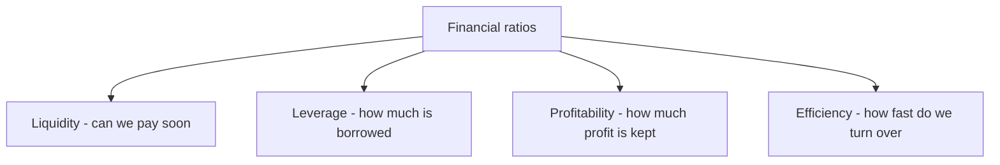
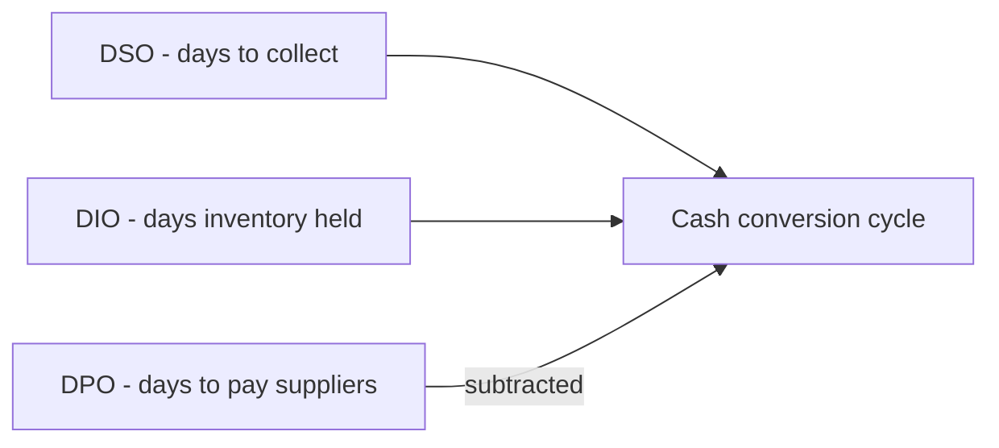

# Lecture 3 — Ratios That Predict Trouble

> **Duration:** ~2 hours. **Outcome:** You can compute the four core ratio families — liquidity, leverage, profitability, and efficiency — in SQL, across multiple periods, and you can read Crunch Machine Co.'s five-year trend and name, specifically, what's going wrong and why it matters.

## 1. A ratio is a comparison, and a trend is the real signal

A financial ratio is just one number divided by another, chosen so the result means something a raw dollar figure doesn't. "Crunch Machine Co. has $1.6 million in cash" tells you almost nothing on its own — is that a lot or a little? "Crunch Machine Co.'s current ratio is 1.73" is more useful, because it's directly comparable across companies of any size and across time.

But here is the idea this whole lecture is built around, and the one the week's title promises: **a single ratio, on its own, rarely tells you much. A ratio measured every year for five years, moving steadily in one direction, tells you almost everything.** A current ratio of 1.73 could belong to a perfectly healthy company that's always run lean. The same 1.73 belonging to a company whose current ratio was 2.89 five years ago is a company in decline — and that's the situation you're about to compute, directly from Crunch Machine Co.'s data.

There are four families of ratios. Each answers a different question about the same set of statements.


*The four ratio families and the question each one answers.*

## 2. Liquidity ratios — can we pay what's due soon?

Liquidity ratios compare **current assets** (cash and things that turn into cash within a year) to **current liabilities** (what's due within a year). They answer: *if every bill due this year came due tomorrow, could we cover it?*

**Current ratio** = current assets ÷ current liabilities

```sql
SELECT fiscal_year,
       total_current_assets, total_current_liabilities,
       ROUND(total_current_assets / total_current_liabilities, 2) AS current_ratio
FROM balance_sheet
ORDER BY fiscal_year;
```

A current ratio above 1.0 means current assets exceed current liabilities — on paper, the company can cover what's due. Run this and you'll see Crunch Machine Co. slide from **2.68 in 2021 to 1.73 in 2025** — still technically "healthy" by the above-1.0 standard, but the *direction* is the warning: every year, the cushion gets thinner.

**Quick ratio** (a.k.a. acid-test ratio) = (current assets − inventory) ÷ current liabilities. Inventory is stripped out because it's the least liquid current asset — it has to be *sold* before it becomes cash, and a company in trouble often can't sell inventory fast enough (or at full price) to matter.

```sql
SELECT fiscal_year,
       ROUND((total_current_assets - inventory) / total_current_liabilities, 2) AS quick_ratio
FROM balance_sheet
ORDER BY fiscal_year;
```

Watch this one closely: it falls from **1.81 in 2021 to 0.84 in 2025** — crossing below 1.0. That crossing is a real threshold analysts watch for: it means that if every current liability came due and the company had to rely only on cash and receivables (no time to liquidate inventory), it would come up short.

**Cash ratio** = cash ÷ current liabilities — the strictest liquidity test, counting *only* actual cash:

```sql
SELECT fiscal_year,
       ROUND(cash / total_current_liabilities, 2) AS cash_ratio
FROM balance_sheet
ORDER BY fiscal_year;
```

This one falls off a cliff: **1.04 in 2021 to 0.13 in 2025.** By 2025, cash alone covers only 13% of what's due within the year. Three liquidity ratios, three different strictness levels, all telling the exact same story with increasing urgency.

## 3. Leverage ratios — how much of this is borrowed?

Leverage (also called solvency) ratios measure how much of the company is financed by debt versus by its own equity, and whether it's earning enough to safely service that debt.

**Debt-to-equity** = total debt (short-term + long-term) ÷ total equity:

```sql
SELECT fiscal_year,
       (short_term_debt + long_term_debt) AS total_debt,
       total_equity,
       ROUND((short_term_debt + long_term_debt) / total_equity, 2) AS debt_to_equity
FROM balance_sheet
ORDER BY fiscal_year;
```

This climbs from **0.39 in 2021 to 1.04 in 2025** — debt now *exceeds* equity. A ratio crossing 1.0 here means lenders technically have a larger claim on the company's assets than the owners do.

**Debt-to-assets** = total debt ÷ total assets — what fraction of everything the company owns is funded by borrowing:

```sql
SELECT fiscal_year,
       ROUND((short_term_debt + long_term_debt) / total_assets, 3) AS debt_to_assets
FROM balance_sheet
ORDER BY fiscal_year;
```

**Interest coverage ratio (times interest earned)** = operating income ÷ interest expense — the one that ties leverage directly back to the income statement. It answers: *how many times over could the company pay this year's interest bill out of this year's operating profit?*

```sql
SELECT bs.fiscal_year,
       inc.operating_income, inc.interest_expense,
       ROUND(inc.operating_income / inc.interest_expense, 1) AS interest_coverage
FROM income_statement inc
JOIN balance_sheet bs ON bs.fiscal_year = inc.fiscal_year
ORDER BY inc.fiscal_year;
```

This is the sharpest leverage warning in the whole dataset: interest coverage collapses from **11.5× in 2021 to just 1.6× in 2025.** Most lenders get nervous below 2×–3× — below that, a single bad quarter could leave the company unable to make its interest payments out of operating profit alone. Rising debt (the numerator problem) *and* shrinking operating income (the denominator problem) are both hitting this ratio at once, which is why it moves faster than either debt-to-equity or the margins alone.

## 4. Profitability ratios — how much of each sales dollar is kept?

You already computed the three margins in Lecture 1 — gross, operating, and net margin (each: the relevant profit line ÷ revenue). Two more belong in this family because they measure profit against what was *invested* to generate it, not just against sales:

**Return on assets (ROA)** = net income ÷ total assets — how efficiently the company turns everything it owns into profit:

```sql
SELECT inc.fiscal_year,
       ROUND(inc.net_income / bs.total_assets * 100, 1) AS roa_pct
FROM income_statement inc
JOIN balance_sheet bs ON bs.fiscal_year = inc.fiscal_year
ORDER BY inc.fiscal_year;
```

**Return on equity (ROE)** = net income ÷ total equity — the return the *owners* specifically are earning on their stake:

```sql
SELECT inc.fiscal_year,
       ROUND(inc.net_income / bs.total_equity * 100, 1) AS roe_pct
FROM income_statement inc
JOIN balance_sheet bs ON bs.fiscal_year = inc.fiscal_year
ORDER BY inc.fiscal_year;
```

ROE falls from roughly 16.9% in 2021 to about 3.3% in 2025 — a return that no longer clears most investors' cost of capital (a concept Week 3 formalizes). Worth naming explicitly: ROE can *rise* even while a business gets *worse*, if leverage increases fast enough — a smaller equity base can make a shrinking net income look like a less-terrible percentage. That's exactly why you never read one ratio alone; you read ROE next to debt-to-equity, together, or it can actively mislead you.

## 5. Efficiency ratios — how fast does the business turn over?

Efficiency ratios measure how quickly a company converts investments in working capital (receivables, inventory, payables) back into cash. They're usually expressed in **days**, which is far more intuitive than a bare turnover multiple.

**Days sales outstanding (DSO)** = accounts receivable ÷ revenue × 365 — on average, how many days does it take to collect a sale after it's made?

```sql
SELECT fiscal_year,
       ROUND(accounts_receivable / revenue * 365, 1) AS dso_days
FROM balance_sheet bs
JOIN income_statement inc USING (fiscal_year)
ORDER BY fiscal_year;
```

**Days inventory outstanding (DIO)** = inventory ÷ COGS × 365 — how many days of inventory are sitting on the shelf, on average, before it sells:

```sql
SELECT fiscal_year,
       ROUND(inventory / cogs * 365, 1) AS dio_days
FROM balance_sheet bs
JOIN income_statement inc USING (fiscal_year)
ORDER BY fiscal_year;
```

**Days payable outstanding (DPO)** = accounts payable ÷ COGS × 365 — how many days, on average, before the company pays its own suppliers:

```sql
SELECT fiscal_year,
       ROUND(accounts_payable / cogs * 365, 1) AS dpo_days
FROM balance_sheet bs
JOIN income_statement inc USING (fiscal_year)
ORDER BY fiscal_year;
```

Put them together and you get the **cash conversion cycle (CCC)** = DSO + DIO − DPO — the number of days, net, that cash is tied up between paying for inputs and collecting from customers:

```sql
SELECT fiscal_year,
       ROUND(dso_days + dio_days - dpo_days, 1) AS cash_conversion_cycle_days
FROM (
    SELECT bs.fiscal_year,
           accounts_receivable / revenue * 365 AS dso_days,
           inventory / cogs * 365 AS dio_days,
           accounts_payable / cogs * 365 AS dpo_days
    FROM balance_sheet bs
    JOIN income_statement inc USING (fiscal_year)
) t
ORDER BY fiscal_year;
```

Run all four. DSO rises from about 40 days to 62 days; DIO rises from about 84 days to 122 days; DPO rises more modestly, from about 48 to 57 days. The company is collecting slower, holding inventory longer, and only partially offsetting that by stretching its own suppliers — the cash conversion cycle lengthens across the entire five years. Every one of those extra days is cash tied up in the operating cycle instead of sitting in the bank — which is the mechanical, line-by-line explanation for why the liquidity ratios in Section 2 are falling.


*How the three efficiency ratios combine into the cash conversion cycle.*

## 6. Reading trends, not points — the discipline

Every ratio in this lecture was computed the same way each time: as a query returning **one row per year**, not one number. That's deliberate. The discipline this course wants you to build is: never compute a ratio for a single period and stop. Always pull the same ratio across every period you have, and look at the *shape* of the line before you say anything about the company.

A useful habit: compute the change year over year, not just the levels, using `LAG()`:

```sql
SELECT fiscal_year,
       ROUND(total_current_assets / total_current_liabilities, 2) AS current_ratio,
       ROUND(total_current_assets / total_current_liabilities
             - LAG(total_current_assets / total_current_liabilities) OVER (ORDER BY fiscal_year), 2)
             AS yoy_change
FROM balance_sheet
ORDER BY fiscal_year;
```

A ratio that's merely low isn't automatically a red flag — some healthy, capital-light businesses run a current ratio near 1.0 by design. A ratio that's **declining every single year for five straight years**, across *every* liquidity measure simultaneously, is the pattern that should make you stop and ask what's driving it — which is precisely Challenge 2 this week.

## 7. Check yourself

- Name the four ratio families this lecture covers, and the one-sentence question each one answers.
- Why does stripping inventory out of the quick ratio make it a stricter test than the current ratio?
- Crunch Machine Co.'s interest coverage falls from 11.5× to 1.6× over five years. Name the two separate causes — one from the income statement, one from the balance sheet — that are each pushing this ratio down.
- Explain, in your own words, how ROE could theoretically improve even while a company's underlying business is deteriorating. What ratio would you check alongside ROE to catch this?
- What does a lengthening cash conversion cycle mean operationally — what is literally happening inside the business day to day?

## Further reading

- **CFA Institute — Financial Ratio Analysis (Level I curriculum overview):** <https://www.cfainstitute.org/en/membership/professional-development/refresher-readings/financial-analysis-techniques>
- **Federal Reserve — Financial Ratios used in bank and corporate credit analysis:** <https://www.federalreserve.gov/>
- **Aswath Damodaran — "Ratio Analysis" teaching notes (NYU Stern, free):** <https://pages.stern.nyu.edu/~adamodar/>
