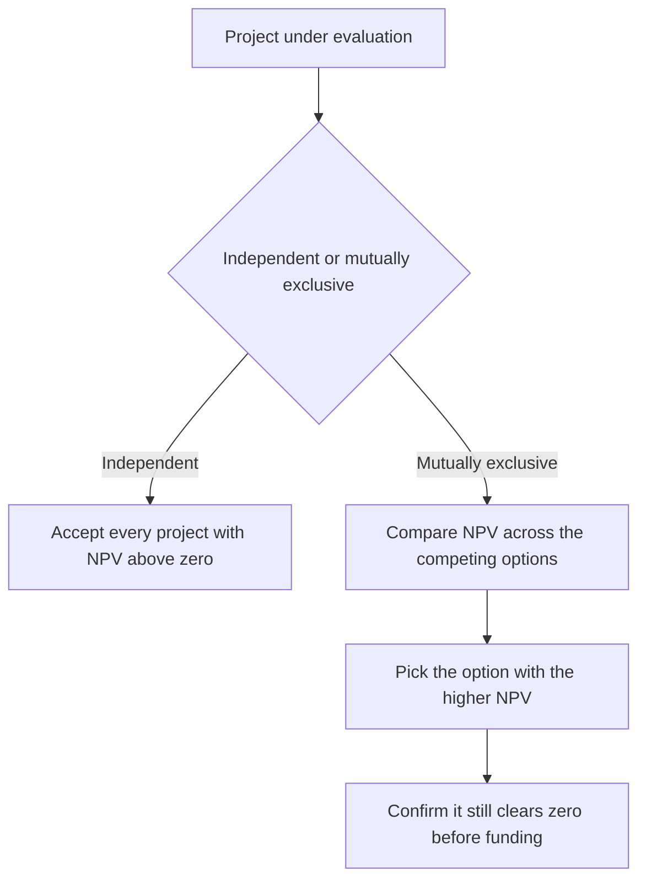

# Lecture 1 — NPV: The Decision Rule

> **Duration:** ~2 hours. **Outcome:** You can discount a project's entire cash-flow stream to a single NPV number, in Python and in SQL, state the accept/reject rule from memory, and explain why NPV — not "does it feel profitable" — is the number a rational capital allocator acts on.

Week 1 taught you to discount a single cash flow, and a stream of them, back to today's dollars. This lecture gives that skill a name and a job: **Net Present Value (NPV)**, the metric every other capital-budgeting metric in this course either supports or gets measured against.

## 1. NPV, formally

NPV is the sum of every cash flow in a project's life, each discounted back to today at the project's hurdle rate:

```
NPV = Σ CFₜ / (1 + r)^t     for t = 0, 1, 2, ..., n
```

Where `CFₜ` is the (signed) cash flow in period `t`, and `r` is the hurdle rate — the minimum annual return the project must clear to be worth doing. Period 0 is today, so `CF₀` (almost always the negative up-front investment) is never discounted — it's already in today's dollars.

Read the formula in plain English: **NPV is "everything the project pays you, in today's money, minus everything it costs you, in today's money."** If that number is positive, the project creates more value than it consumes at the given hurdle rate. If it's negative, the project destroys value even though the raw, undiscounted cash flows might look fine on paper.

## 2. The decision rule

This is the entire rule, and it is worth memorizing word for word:

> **Accept a project if NPV > 0. Reject it if NPV < 0. You're indifferent (in theory) if NPV = 0.**

For **mutually exclusive** projects (you can only pick one of several competing options — e.g., "build the warehouse in Ohio *or* Texas, not both"), the rule extends to: **pick the one with the higher NPV**, provided both clear zero. A project with a smaller *positive* NPV than a rejected alternative is still the wrong pick if you can only choose one.

For **independent** projects (accepting one doesn't preclude accepting another — most of a company's project list, if capital is unlimited), the rule is simpler still: **accept every project with NPV > 0.** Each one adds value on its own; there's no competition between them unless a budget constraint forces you to choose (that's Lecture 3).


*Decision path from a project's independence status to the accept or reject call.*

## 3. Worked example — the New CNC Machine

You built this exact number in Week 1 by hand. Recall the stream (project 1 in this week's `cash_flows` table, hurdle rate 7%):

| Period | Cash flow | Discount factor `1/(1.07)^t` | PV of this flow |
|-------:|----------:|-------------------------------:|-----------------:|
| 0 | −180,000 | 1.0000 | −180,000.00 |
| 1 | 55,000 | 0.9346 | 51,401.87 |
| 2 | 58,000 | 0.8734 | 50,659.45 |
| 3 | 60,000 | 0.8163 | 48,977.87 |
| 4 | 60,000 | 0.7629 | 45,773.71 |
| 5 | 77,000 | 0.7130 | 54,899.94 |
| **NPV** | | | **≈ +71,712.84** |

NPV is positive and comfortably so — this project clears its 7% hurdle rate by a wide margin. Under the decision rule: **accept.**

Notice something the raw cash-flow total hides. Sum the undiscounted flows: `-180,000 + 55,000 + 58,000 + 60,000 + 60,000 + 77,000 = 130,000`. That "the project makes $130,000" framing is what a spreadsheet built by someone in a hurry often reports. It is not the same number as NPV, and it is not the number that matters — it ignores that the $77,000 arriving in year 5 is worth meaningfully less than $77,000 today. NPV is the correction.

## 4. Why the hurdle rate isn't optional

The hurdle rate `r` is doing real work in that formula — it isn't a knob you can leave at a round number and move on. Two things determine what `r` *should* be for a given project:

1. **Opportunity cost.** If your company can reliably earn 7% putting capital into other projects of similar risk, then any new project has to beat 7% or it's a worse use of the same dollar. The hurdle rate is the return you're giving up by choosing this project over the next-best alternative.
2. **Risk.** Riskier projects need a higher hurdle rate, because a dollar of uncertain future cash flow is worth less than a dollar of certain future cash flow, even before you get to the time-value discount. That's why this week's table has six different hurdle rates: Low-risk Solar Retrofit at 6%, Medium-risk Warehouse Expansion and Brand Relaunch at 10%, High-risk R&D and European Market Entry at 15–18%. Same dollar, same year, worth less today the riskier the project.

You'll learn the formal machinery for *setting* a hurdle rate — CAPM, cost of debt, WACC — in Week 4. This week, treat the `hurdle_rate` column as given, and focus on what changes in your accept/reject conclusion when it moves (Challenge 2 makes you prove this).

## 5. NPV is additive — and that matters

A property worth internalizing: **NPVs of independent projects add up.** If Project A has NPV of $71,713 and Project B has NPV of $23,571 (that second figure is this week's Brand Relaunch Campaign — you'll compute it in Exercise 1), undertaking both adds $95,284 of value — no interaction terms, no double-counting, as long as the projects genuinely don't share cash flows or capacity constraints. This is called **value additivity**, and it's why a company can evaluate its entire project pipeline project-by-project and just sum the accepted ones to get the pipeline's total value creation. IRR, as you'll see next lecture, does **not** have this property — you cannot add two IRRs together and get anything meaningful.

## 6. Computing NPV in Python

`numpy_financial` gives you `npv()` directly, but it's worth understanding what it does under the hood by writing your own version first:

```python
def npv(rate: float, cash_flows: list[float]) -> float:
    """NPV of a cash-flow list where cash_flows[0] is period 0."""
    return sum(cf / (1 + rate) ** t for t, cf in enumerate(cash_flows))

cnc_flows = [-180000, 55000, 58000, 60000, 60000, 77000]
print(round(npv(0.07, cnc_flows), 2))   # 71712.84
```

Cross-check with `numpy_financial`:

```python
import numpy_financial as npf

print(round(npf.npv(0.07, cnc_flows), 2))   # 71712.84 — same answer, less code
```

**Watch the period-5 collapse.** In the seed table, period 5 for project 1 has *two rows* — a 62,000 revenue flow and a 15,000 salvage flow, both dated the same period. When you pull data out of SQL, you sum same-period flows into one number before handing the list to `npv()` — that's exactly what the `77,000` in row `t=5` above is: `62,000 + 15,000`.

## 7. Computing NPV in SQL

The same computation, over the seeded table, for every project at once:

```sql
SELECT
    project_id,
    project_name,
    hurdle_rate,
    ROUND(SUM(amount / POWER(1 + hurdle_rate, period)), 2) AS npv
FROM cash_flows
GROUP BY project_id, project_name, hurdle_rate
ORDER BY npv DESC;
```

This single query ranks every project in the table by NPV in one pass — no exporting to a workbook, no copy-pasted formula that silently breaks when a row gets inserted in the wrong place. Change a `hurdle_rate` in one row and every downstream ranking recalculates correctly on the next run. This is the entire argument for the course's data-tooling rule made concrete: the ranking *is* the query, not a cell formula somebody has to remember to drag down.

Run it now, on all six projects. Do not be surprised if most of them come back **negative**. Real capital-budgeting slates are exactly like this — plenty of projects that *sound* good in a pitch meeting don't actually clear their hurdle rate once you discount properly. Finding that out early, cheaply, with a query, is the entire point of doing this analysis before capital is committed. Exercise 1 has you run this for real and see precisely which of the six survive.

## 8. What NPV assumes about reinvestment

NPV implicitly assumes that any cash the project throws off in interim periods gets reinvested at the hurdle rate `r` — the same rate used to discount. This is a far more defensible assumption than the one IRR makes (next lecture), because the hurdle rate is set to reflect what the company can actually, realistically earn on capital of this risk class. It is not a claim about some exotic reinvestment opportunity — it is close to a tautology: "money not spent on this project could earn `r` elsewhere," which is exactly the definition of the hurdle rate to begin with.

## 9. The NPV profile — seeing the whole curve

A useful diagnostic tool for later lectures: plot NPV as a function of the discount rate, holding the cash-flow stream fixed. This is called the project's **NPV profile**.

```python
import numpy_financial as npf

rates = [r / 100 for r in range(0, 26)]   # 0% to 25%
profile = [(r, round(npf.npv(r, cnc_flows), 2)) for r in rates]
for r, val in profile[::5]:
    print(f"{r:.0%}: {val:,.2f}")
```

```
0%:   130,000.00
5%:   86,512.58
10%:  51,804.52
15%:  23,721.20
20%:  713.09
25%:  -18,352.64
```

Notice the curve crosses zero somewhere between 20% and 25% (barely still positive at 20%, solidly negative by 25%) — that crossing point is, by definition, the project's **IRR**, which is the subject of the entire next lecture. The NPV profile is the bridge between the two metrics: IRR is just "the discount rate where the NPV profile hits zero."

## 10. Common mistakes

- **Reporting the undiscounted total as if it were NPV.** As Section 3 showed, they can look similar in magnitude and still lead to opposite conclusions once timing matters.
- **Discounting the period-0 cash flow.** It's a bug you'll see again this week — the initial investment is already in today's dollars.
- **Using one company-wide hurdle rate for every project regardless of risk.** A low-risk facilities retrofit and a high-risk international expansion do not deserve the same discount rate, and using one anyway systematically over-funds risky projects and under-funds safe ones.
- **Treating NPV = 0 as "reject."** Formally it's indifference — the project exactly clears its opportunity cost. In practice, tie-breaking usually goes to strategic factors outside the model, not an automatic reject.

## 11. Check yourself

- Write the NPV formula from memory, and explain in one sentence why period 0 is never discounted.
- What does "value additivity" mean, and why does IRR not have this property (you'll prove this properly next lecture — for now, just state the claim)?
- Two projects have the same NPV but very different sizes (one costs $50,000, the other $2,000,000). Does NPV alone tell you which is the better use of capital? What's missing?
- What does NPV implicitly assume about the rate at which interim cash flows get reinvested?
- Sketch, roughly, what an NPV profile looks like for a normal project (one negative flow followed by positive flows) — does NPV rise or fall as the discount rate rises, and why?

Lecture 2 takes that last question about "very different sizes" and the NPV-profile crossing point from Section 9, and turns them into the central case against relying on IRR alone.

## Further reading

- **Investopedia — "Net Present Value (NPV)":** <https://www.investopedia.com/terms/n/npv.asp>
- **Investopedia — "Value Additivity":** <https://www.investopedia.com/terms/v/valuation-additivity-principle.asp>
- **numpy-financial documentation (`npv`):** <https://numpy.org/numpy-financial/latest/npv.html>
- **PostgreSQL — Aggregate Functions:** <https://www.postgresql.org/docs/current/functions-aggregate.html>
