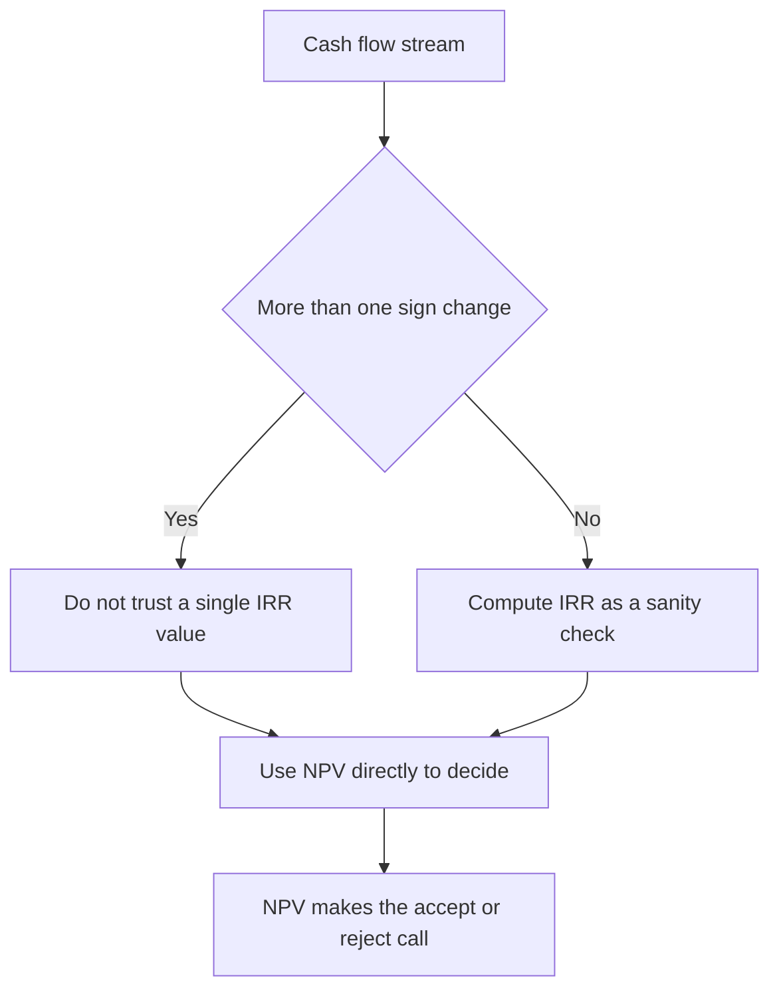

# Lecture 2 — IRR and Its Traps

> **Duration:** ~2 hours. **Outcome:** You can compute IRR and MIRR in Python, explain what each one actually measures, and — the real point of this lecture — construct and recognize the three specific situations (scale, timing, multiple roots) where IRR ranks projects in the wrong order while NPV keeps ranking them correctly.

IRR is the most popular capital-budgeting metric in the world, for a good reason: "this project returns 20% a year" is intuitive in a way "this project has an NPV of $71,713" is not. That intuition is also exactly what makes IRR dangerous — it invites you to compare projects by their percentage return the way you'd compare two savings accounts, and that comparison quietly breaks in three specific, well-documented ways. This lecture builds IRR properly, then breaks it on purpose so you recognize the breakage in the wild.

## 1. IRR, formally

The **Internal Rate of Return** is the discount rate `r*` that makes a project's NPV exactly zero:

```
0 = Σ CFₜ / (1 + r*)^t     for t = 0, 1, 2, ..., n
```

There's no algebraic formula that solves this directly for most cash-flow streams (it's a polynomial in `1/(1+r*)` of degree `n`) — you find it numerically, by trying rates until NPV lands on zero. That's exactly what Lecture 1's NPV profile (Section 9) was building toward: **IRR is the rate where the NPV profile crosses the x-axis.**

## 2. The decision rule for IRR

> **Accept a project if IRR > hurdle rate. Reject if IRR < hurdle rate.**

For the New CNC Machine (hurdle rate 7%), you already saw the NPV profile cross zero somewhere between 20% and 25%. Solve for it precisely in Python:

```python
import numpy_financial as npf

cnc_flows = [-180000, 55000, 58000, 60000, 60000, 77000]
irr = npf.irr(cnc_flows)
print(f"{irr:.4%}")   # 20.1713%
```

IRR ≈ 20.17%, comfortably above the 7% hurdle rate — same accept decision NPV gave you, which is reassuring: **for a single, independent, "normal" project (one sign change, cash out then cash in), IRR and NPV always agree on accept/reject.** The traps below only bite once you're *comparing* or *ranking* projects, or once a project's cash flows aren't "normal."

## 3. Trap #1 — the scale problem

IRR is a percentage. Percentages don't know how big the underlying dollars are, and that's the whole trap.

Compare two mutually exclusive projects — pick one, not both:

| Project | Period 0 | Period 1 | IRR | NPV @ 10% |
|---|---:|---:|---:|---:|
| **Small** | −10,000 | 15,000 | 50.0% | +3,636.36 |
| **Large** | −500,000 | 600,000 | 20.0% | +45,454.55 |

IRR screams "pick Small — 50% beats 20%!" NPV says the opposite: Large creates **more than twelve times as much value** ($45,454.55 vs. $3,636.36) at the company's actual 10% hurdle rate. Small's 50% return is real, but it's a 50% return on a small amount of capital; Large's 20% return is on fifty times as much capital, and 20% on a large base beats 50% on a small one every time the smaller project can't be scaled up to absorb the difference. **IRR cannot see dollar magnitude. NPV is denominated in dollars, which is exactly what a company is trying to maximize.**

This is why, whenever you're picking between mutually exclusive projects of meaningfully different size, **IRR alone is the wrong tool.** NPV — or, if capital is constrained rather than the choice being purely binary, the profitability index from Lecture 3 — is what you rank on.

## 4. Trap #2 — the timing problem (crossover rate)

Even two projects of *identical* size can have IRR and NPV disagree, if their cash flows arrive at different times. Compare two mutually exclusive $200,000 projects:

| Project | Period 0 | Period 1 | Period 2 | Period 3 | IRR |
|---|---:|---:|---:|---:|---:|
| **Front-loaded** | −200,000 | 180,000 | 60,000 | 20,000 | 21.47% |
| **Back-loaded** | −200,000 | 20,000 | 60,000 | 240,000 | 19.36% |

By IRR alone, Front-loaded wins (21.47% > 19.36%). But NPV depends on the hurdle rate, and these two NPV profiles **cross** at some rate — below that crossover, Back-loaded actually has the higher NPV, because at a low discount rate the big period-3 payment isn't punished much, and Back-loaded's total undiscounted cash ($320,000) is larger than Front-loaded's ($260,000). Above the crossover, Front-loaded wins on both metrics.

```python
import numpy_financial as npf

front = [-200000, 180000, 60000, 20000]
back  = [-200000, 20000, 60000, 240000]

for r in [0.02, 0.05, 0.08, 0.10, 0.12, 0.15, 0.18, 0.20]:
    npv_f = npf.npv(r, front)
    npv_b = npf.npv(r, back)
    winner = "Front" if npv_f > npv_b else "Back"
    print(f"r={r:.0%}: front={npv_f:,.0f}  back={npv_b:,.0f}  -> {winner}")
```

```
r=2%:  front=52,987  back=103,435  -> Back
r=5%:  front=43,127  back=80,790   -> Back
r=8%:  front=33,984  back=60,479   -> Back
r=10%: front=28,249  back=48,084   -> Back
r=12%: front=22,782  back=36,516   -> Back
r=15%: front=15,041  back=20,564   -> Back
r=18%: front=7,806    back=6,112   -> Front
r=20%: front=3,241    back=-2,778  -> Front
```

The crossover — the rate at which the two projects tie on NPV — sits at **≈17.26%** here (solvable directly with `scipy.optimize.brentq` on the function `npf.npv(r, front) - npf.npv(r, back)`, which is exactly what Challenge 1 has you do). **Which project is actually better depends entirely on the company's real hurdle rate, not on comparing the two IRRs to each other.** At any hurdle rate below ≈17.26% — which covers every single hurdle rate in this week's `cash_flows` table (6% to 18%, and even the riskiest project's 18% sits right at the edge) — Back-loaded has the higher NPV *despite having the lower IRR*. A capital allocator who ranked these two projects by IRR alone would pick Front-loaded at, say, a 10% hurdle rate, and hand the company $19,835 less value than picking Back-loaded would have ($48,084 − $28,249). That gap is not a rounding error — it's the entire trap, in dollars.

## 5. Trap #3 — multiple IRRs (and no IRR at all)

IRR is a root of a polynomial. **A polynomial can have as many real roots as it has sign changes in its coefficients (Descartes' rule of signs) — which means a cash-flow stream that changes sign more than once can have more than one IRR**, or, in some cases, none at all in the real numbers.

This isn't a corner case invented for a textbook — it happens routinely in projects with a large decommissioning or cleanup cost at the end: mines, oil wells, nuclear facilities, wind farms with an end-of-life teardown obligation. The signal to watch for is the **number of sign changes** in the ordered cash-flow list — count `-` to `+` and `+` to `-` transitions; consecutive flows with the same sign (like this week's AI Quality-Control R&D project, which is negative at both period 0 *and* period 1 before turning positive — one sign change, not two, since − to − isn't a change) don't add a potential root. A single sign change means at most one IRR; two or more sign changes means you need to check.

A cleaner illustration, a classic "investment, then payoff, then cleanup cost" stream with **two** sign changes (− then + then −):

```python
import numpy_financial as npf
import numpy as np

# -100 today, +230 next year, -132 the year after (cleanup/shutdown cost)
flows = [-100, 230, -132]

# Solve for x = 1/(1+r) first: coefficients in descending power order
x_roots = np.roots(flows[::-1])
print(x_roots)
# array([0.90909, 0.83333])  <- both real, both between 0 and 1

r_roots = 1 / x_roots - 1
print(r_roots)
# array([0.10, 0.20])  <- convert back to rates: r = 10% and r = 20%

print(npf.irr(flows))
# numpy_financial's irr() returns just ONE of them — often the first it finds
```

Both r = 10% and r = 20% make this project's NPV exactly zero. **"What is the IRR of this project?" has no single correct answer** — asking the question at all is a category error for this cash-flow shape. `numpy_financial.irr()` will hand you back *a* number without warning you there's another one lurking, which is precisely why blindly trusting a library's `irr()` output on an unfamiliar cash-flow stream is a real risk in practice, not a theoretical one.

**The fix: plot the NPV profile first.** If it crosses zero more than once, IRR is not a reliable metric for that project — full stop. Use NPV directly; it never has this ambiguity, because NPV at a *given* hurdle rate is always a single, unambiguous number, however many times the underlying polynomial would cross zero elsewhere.

## 6. MIRR — fixing (some of) IRR's problems

**Modified Internal Rate of Return (MIRR)** patches IRR's worst structural flaw: standard IRR implicitly assumes every interim positive cash flow gets reinvested *at the IRR itself* — which, if the IRR is 40%, is a wildly optimistic assumption about the company's next investment opportunity. MIRR instead lets you specify a realistic **reinvestment rate** for positive flows and a **finance rate** for negative flows, compounds/discounts everything to the ends of the timeline at those explicit rates, and only then backs out a single rate of return. Because everything gets moved to just two points in time (today and the final period), MIRR also **cannot have multiple roots** — it's a single well-defined number by construction.

```
MIRR = ( FV(positive flows, reinvested at rᵣ) / PV(negative flows, discounted at r_f) )^(1/n) − 1
```

```python
import numpy_financial as npf

cnc_flows = [-180000, 55000, 58000, 60000, 60000, 77000]

mirr = npf.mirr(cnc_flows, finance_rate=0.07, reinvest_rate=0.07)
print(f"{mirr:.4%}")   # 14.4222%
```

Notice **MIRR (14.42%) is lower than IRR (20.17%)** for the same project, using the same 7% rate both ways. That gap is the entire point: standard IRR was overstating the project's true annualized return by assuming an unrealistic 20.17% reinvestment rate on the interim cash flows; MIRR corrects that to the actually-achievable 7%. MIRR is still not additive across projects the way NPV is, and it still requires you to *choose* a reinvestment rate (usually the hurdle rate, sometimes a separate estimate of the firm's actual reinvestment opportunities) — but it fixes the reinvestment-assumption and multiple-root problems that plain IRR has.

## 7. So why does anyone still use IRR?

Because it's genuinely useful for two things NPV doesn't do well: it's **scale-free** (easy to compare against a hurdle rate or another firm's cost of capital without knowing project size), and it's **intuitive to non-finance stakeholders** ("20% return" lands better in a room than "$71,713 of NPV"). The right posture, and the one this course teaches: **compute both. Use IRR/MIRR as a communication and sanity-check tool. Let NPV make the actual accept/reject and ranking decision, every time, without exception, especially whenever projects differ in scale, differ in cash-flow timing, or have more than one sign change.**


*Why IRR is a communication tool while NPV always makes the final call.*

## 8. Common mistakes

- **Ranking mutually exclusive projects of different sizes by IRR.** Trap #1. Rank by NPV, or — under a hard budget constraint — by profitability index (Lecture 3).
- **Comparing two IRRs directly without checking for a crossover rate.** Trap #2. The project with the higher IRR is not automatically the one with the higher NPV at your actual hurdle rate.
- **Trusting a single IRR number from a library call without checking the cash-flow sign pattern first.** Trap #3. More than one sign change means: plot the NPV profile before you trust any IRR output.
- **Treating MIRR's reinvestment rate as a free parameter to tune until you like the answer.** It should be set to a defensible estimate of the firm's real reinvestment opportunity — usually the hurdle rate — not reverse-engineered to make a favored project look better.

## 9. Check yourself

- Define IRR in one sentence, in terms of NPV.
- Two mutually exclusive projects: one small with a 60% IRR, one large with a 25% IRR. Which one is more valuable to the company, and what additional number would you need to be sure?
- What is a "crossover rate," and why does it matter more than either project's individual IRR?
- Why can a cash-flow stream with two sign changes have two different IRRs, and what should you do when you find one like that?
- In one sentence, what does MIRR fix about standard IRR that NPV never had a problem with in the first place?

Lecture 3 rounds out the metric toolkit with payback and the profitability index, then shows you how to reconcile all five metrics — NPV, IRR, MIRR, payback, PI — into one ranking when you can't fund every project with positive NPV.

## Further reading

- **Investopedia — "Internal Rate of Return (IRR)":** <https://www.investopedia.com/terms/i/irr.asp>
- **Investopedia — "Modified Internal Rate of Return (MIRR)":** <https://www.investopedia.com/terms/m/mirr.asp>
- **Investopedia — "Multiple Internal Rates of Return":** <https://www.investopedia.com/ask/answers/05/irrmultiplereturns.asp>
- **numpy-financial documentation (`irr`, `mirr`):** <https://numpy.org/numpy-financial/latest/index.html>
