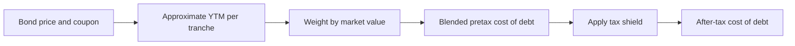
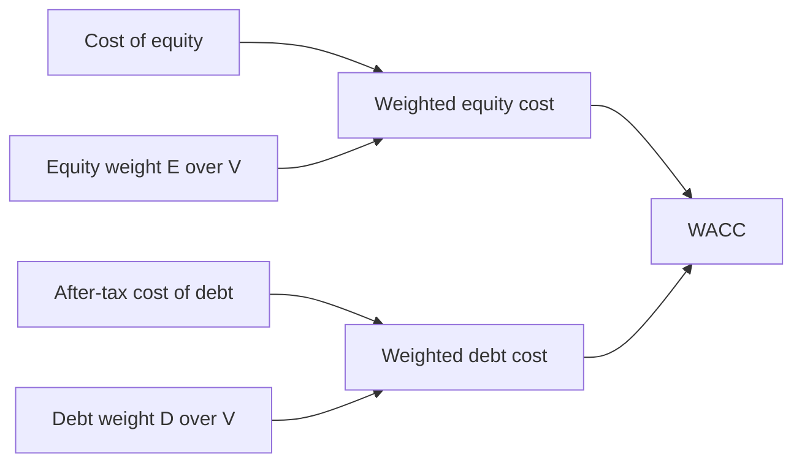

# Lecture 3 — Cost of Debt and WACC

> **Duration:** ~2 hours. **Outcome:** You can estimate a bond's yield to maturity from its price and coupon, blend several tranches into one weighted after-tax cost of debt, compute market-value capital weights, and assemble a complete, correctly weighted WACC.

Lecture 1 gave you a cost of equity. Lecture 2 gave you a beta you can defend. This lecture supplies the other half of the capital stack — the cost of debt — and shows you how the two combine into the single number this whole week has been building toward: the weighted average cost of capital.

## 1. Why debt is "cheaper" than equity — and why that's not the whole story

Two things make debt's cost lower than equity's, holding everything else equal:

1. **Debt holders get paid first.** In bankruptcy, creditors are repaid before shareholders see a cent — debt is structurally less risky, so investors demand a lower return for holding it.
2. **Interest is tax-deductible.** A company's interest payments reduce its taxable income, which reduces its tax bill — a benefit equity dividends don't get (dividends are paid *after* tax). This is called the **interest tax shield**, and it's why the cost of debt you use in WACC is always **after-tax**, never the raw rate a bond pays.

That combination — lower pre-tax cost, plus a tax deduction on top — is exactly why companies use debt at all, despite the extra risk it adds (recall from Lecture 2: more debt raises the levered equity beta, and therefore the cost of equity, too). Cheap debt isn't free — it makes the *remaining* equity riskier. WACC is where that trade-off gets priced out fully, because it accounts for both effects: debt's lower after-tax cost, and its knock-on effect on equity's required return via beta.

## 2. Estimating cost of debt from bond prices: yield to maturity

The **coupon rate** printed on a bond is not its cost to the company today — that's a fixed, historical rate set when the bond was issued. What matters for WACC is the bond's **yield to maturity (YTM)**: the return an investor buying the bond *today, at its current market price*, would earn if they held it to maturity. If interest rates have risen since issuance, the bond trades below par (price < 100) and its YTM is *higher* than its coupon — investors demand a discount to accept a below-market coupon. If rates have fallen, the reverse: the bond trades above par and its YTM is *lower* than its coupon.

The exact YTM requires solving a polynomial (there's no closed-form algebraic solution once you sum a multi-year stream of discounted coupons), but a well-known **approximation formula** gets within a few basis points for most investment-grade bonds and is more than accurate enough for a WACC estimate:

$$
YTM \approx \frac{C + \dfrac{F - P}{n}}{\dfrac{F + P}{2}}
$$

where $C$ is the annual coupon payment (per $100 of face value), $F$ is the face value ($100 by convention), $P$ is the current market price (per $100 of face value), and $n$ is the number of years to maturity. Read the numerator as "the coupon, plus the annualized capital gain or loss from now to maturity"; the denominator as "the average of what you paid and what you'll get back" — together, roughly, your average annual return relative to your average capital at risk.


*The pipeline from raw bond data to the after-tax cost of debt that feeds WACC.*

### 2.1 Applying it to Crunch Machine Co.'s three tranches

Crunch Machine Co. has three bonds outstanding, all in `debt_tranches`:

```sql
SELECT description, face_value, coupon_rate, price_pct_par, years_to_mat, rating
FROM debt_tranches
ORDER BY tranche_id;
```

```
       description        | face_value | coupon_rate | price_pct_par | years_to_mat | rating
---------------------------+------------+-------------+----------------+--------------+--------
 Senior Notes due 2029     |  150000000 |      0.0525 |          98.50 |            3 | BBB
 Term Loan B due 2031      |  100000000 |      0.0610 |          99.00 |            5 | BBB-
 Green Bond due 2028       |   75000000 |      0.0475 |         101.25 |            2 | A-
```

Compute each tranche's approximate YTM in Python:

```python
import pandas as pd
from sqlalchemy import create_engine

engine = create_engine("postgresql+psycopg://localhost/crunch_capital")
debt = pd.read_sql("SELECT * FROM debt_tranches ORDER BY tranche_id", engine)

F = 100.0   # face value per $100 of par, by convention
debt["annual_coupon"] = debt["coupon_rate"] * F
debt["ytm_approx"] = (
    (debt["annual_coupon"] + (F - debt["price_pct_par"]) / debt["years_to_mat"])
    / ((F + debt["price_pct_par"]) / 2)
)
print(debt[["description", "coupon_rate", "price_pct_par", "ytm_approx"]])
```

```
              description  coupon_rate  price_pct_par  ytm_approx
0  Senior Notes due 2029        0.0525          98.50    0.057930
1   Term Loan B due 2031        0.0610          99.00    0.063324
2   Green Bond due 2028         0.0475         101.25    0.040988
```

Notice the pattern: the **Senior Notes** and **Term Loan B** both trade *below* par, so their YTM (5.79%, 6.33%) is *above* their coupon (5.25%, 6.10%) — the market is demanding more than the stated coupon to hold them. The **Green Bond** trades *above* par (101.25), so its YTM (4.10%) is *below* its 4.75% coupon — it's a shorter, higher-rated (A-) tranche that the market is willing to accept a lower return on, consistent with its better credit rating and shorter time to maturity.

### 2.2 Blending tranches into one cost of debt: market-value weights

A company rarely has just one bond, so its cost of debt is a **weighted average** across every tranche — and the correct weights are each tranche's **market value**, not its face value. A bond trading at 101.25 represents more capital currently invested by creditors than its face value alone suggests; weighting by face value would understate that.

```python
debt["market_value"] = debt["face_value"] * (debt["price_pct_par"] / 100)
total_debt_mv = debt["market_value"].sum()
debt["mv_weight"] = debt["market_value"] / total_debt_mv

pretax_cost_of_debt = (debt["ytm_approx"] * debt["mv_weight"]).sum()
print(debt[["description", "market_value", "mv_weight", "ytm_approx"]])
print(f"\nTotal debt market value: ${total_debt_mv:,.0f}")
print(f"Weighted-average pre-tax cost of debt: {pretax_cost_of_debt:.4%}")
```

```
              description  market_value  mv_weight  ytm_approx
0  Senior Notes due 2029    147,750,000   0.457864    0.057930
1   Term Loan B due 2031     99,000,000   0.306788    0.063324
2   Green Bond due 2028      75,937,500   0.235348    0.040988

Total debt market value: $322,687,500
Weighted-average pre-tax cost of debt: 5.5599%
```

**Pre-tax cost of debt ≈ 5.56%.** Now apply the tax shield from Section 1 — this is what makes it the number WACC actually uses:

```python
tax_rate = 0.25   # from capital_structure
after_tax_cost_of_debt = pretax_cost_of_debt * (1 - tax_rate)
print(f"After-tax cost of debt: {after_tax_cost_of_debt:.4%}")   # 4.1699%
```

**After-tax cost of debt ≈ 4.17%.** That's the number — not the 5.56% pre-tax figure, and not any single tranche's coupon — that belongs in the WACC formula.

## 3. Capital weights: market value of equity and debt

WACC weights each source of capital by its share of the company's **total market value**, $V = E + D$ — again, market value, not book value. Book value (what's on the balance sheet, at historical cost) can be wildly different from what the capital is actually worth *today*, especially for equity, whose book value reflects retained earnings and paid-in capital rather than what the market is currently willing to pay for the shares.

**Market value of equity** is simply shares outstanding times the current share price:

```python
cs = pd.read_sql("SELECT * FROM capital_structure WHERE company = 'Crunch Machine Co.'", engine).iloc[0]

latest_price = pd.read_sql(
    "SELECT adj_close FROM stock_prices WHERE ticker = 'CRNM' ORDER BY price_date DESC LIMIT 1",
    engine,
).iloc[0, 0]

equity_mv = cs["shares_outstanding"] * latest_price
print(f"Shares outstanding: {cs['shares_outstanding']:,}")
print(f"Latest share price: ${latest_price:.2f}")
print(f"Market value of equity: ${equity_mv:,.0f}")
```

```
Shares outstanding: 18,000,000
Latest share price: $68.35
Market value of equity: $1,230,300,000
```

**Market value of debt** is the `total_debt_mv` you already computed in Section 2.2 — $322,687,500.

```python
debt_mv = total_debt_mv
V = equity_mv + debt_mv
E_over_V = equity_mv / V
D_over_V = debt_mv / V

print(f"Total capital (V):    ${V:,.0f}")
print(f"Weight of equity:     {E_over_V:.2%}")
print(f"Weight of debt:       {D_over_V:.2%}")
```

```
Total capital (V):    $1,552,987,500
Weight of equity:     79.22%
Weight of debt:       20.78%
```

Crunch Machine Co. is financed roughly 79% equity, 21% debt — a moderately conservative capital structure for an industrial manufacturer, consistent with its `BBB`/`BBB-` credit ratings (comfortably investment-grade, not aggressively levered).

## 4. Assembling the full WACC

Everything is now in place. The formula:

$$
WACC = \frac{E}{V} \times R_e + \frac{D}{V} \times R_d \times (1 - t)
$$

Using the **regression-derived beta from Lecture 2** ($\beta = 1.24$) rather than the vendor beta, because it's the one you can fully audit:


*How equity's and debt's weighted costs sum to the company's WACC.*

```python
rf = cs["risk_free_rate"]
erp = cs["equity_risk_premium"]
beta_regression = 1.2429   # from Lecture 2's np.polyfit

cost_of_equity = rf + beta_regression * erp
wacc = E_over_V * cost_of_equity + D_over_V * after_tax_cost_of_debt

print(f"Cost of equity (regression beta): {cost_of_equity:.4%}")
print(f"After-tax cost of debt:           {after_tax_cost_of_debt:.4%}")
print(f"WACC:                             {wacc:.4%}")
```

```
Cost of equity (regression beta): 10.4646%
After-tax cost of debt:           4.1699%
WACC:                             9.1565%
```

**Crunch Machine Co.'s WACC ≈ 9.16%.** This is the number that belongs as the discount rate in a DCF valuation, and — closing the loop back to Week 3 — it's exactly the kind of number that should have been sitting in `cash_flows.hurdle_rate` all along, rather than a round number assumed without derivation. (Look back at Week 1's `cash_flows` seed data: individual projects there used hurdle rates from 6% to 18% depending on risk tier — a *company-wide* WACC like 9.16% is the sensible floor for a **typical-risk** project; riskier projects, like the "High" risk-tier R&D and market-entry projects, should be discounted at something *above* the company's blended WACC, precisely because they carry more risk than the company's asset base as a whole. That risk-tier adjustment is exactly what Week 5 formalizes.)

If instead you'd used the **vendor beta** (1.30) from Lecture 1:

```python
cost_of_equity_vendor = rf + cs["vendor_beta"] * erp
wacc_vendor = E_over_V * cost_of_equity_vendor + D_over_V * after_tax_cost_of_debt
print(f"WACC (vendor beta): {wacc_vendor:.4%}")   # 9.3828%
```

**9.38%** — about 0.23 percentage points higher than the regression-based estimate. That might sound small, but on a large capital budget, half a point of discount rate can flip a project from NPV-positive to NPV-negative. This is exactly why Lecture 2 insisted on estimating beta yourself: WACC inherits every input's uncertainty, and beta is usually the input with the widest legitimate range of defensible estimates.

## 5. What moves each component of WACC — a summary

| Component | Rises when… | Falls when… | Who controls it |
|-----------|-------------|-------------|------------------|
| $R_f$ (risk-free rate) | Central banks tighten policy; inflation expectations rise | Central banks ease; flight-to-safety demand for government bonds | Macroeconomic, outside the company's control |
| $ERP$ | Markets grow fearful/uncertain (recessions, crises) | Markets grow confident/calm | Macroeconomic, outside the company's control |
| $\beta$ | The company takes on more debt (financial leverage); its business becomes more cyclical or fixed-cost-heavy (operating leverage) | The company delevers; its revenue becomes steadier or more variable-cost | **Substantially within the company's control** — this is the main lever management actually has over its own cost of equity |
| $R_d$ (pre-tax cost of debt) | Credit rating deteriorates; rates rise generally; the company issues longer-dated or riskier debt | Credit rating improves; rates fall; the company delevers or issues shorter/safer debt | Partly controllable (credit quality, debt structure), partly macro (base rates) |
| $t$ (tax rate) | Tax law changes, or the company loses tax shields/credits | Tax law changes, or the company gains deductions/credits | Mostly outside the company's control (tax policy), though tax planning has some effect |
| $E/V$, $D/V$ (weights) | The company issues equity, or its stock price rises; or it pays down debt | The company issues debt or buys back stock; or its stock price falls | **Fully within the company's control** — this is the capital-structure decision Week 5 covers |

The practical takeaway: a company genuinely controls two levers over its own WACC — how much debt it carries (which moves both $\beta$ and the $D/V$ weight, in opposite directions on cost, which is exactly why there's an optimum rather than "more debt is always cheaper") and, more slowly, its business mix (which moves beta through operating leverage). Everything else — rates, the market's risk appetite, tax policy — is handed to the company by the macro environment, and a good analyst separates "what did the company do" from "what did the market do" when a WACC changes from one year to the next.

## 6. Check yourself

- Why is the after-tax cost of debt, not the pre-tax YTM, the number that belongs in WACC?
- A bond trades at 97.00 with a 5% coupon. Is its YTM above or below 5%? Why?
- Why does WACC use market-value weights for $E$ and $D$ rather than book-value weights?
- Compute a company's WACC given: $E/V = 60\%$, $D/V = 40\%$, $R_e = 12\%$, $R_d = 7\%$ (pre-tax), $t = 21\%$.
- Name one WACC input a company's management substantially controls, and one it does not. Explain why the distinction matters when a company's WACC changes year over year.
- Crunch Machine Co.'s WACC came out to 9.16% using the regression beta and 9.38% using the vendor beta. Which would you use for a capital budgeting decision, and what would you tell a stakeholder about the other number?

You now have every piece: a defensible cost of equity, a self-estimated (and comparables-checked) beta, an after-tax cost of debt built from actual bond prices, and market-value weights. The exercises below have you rebuild this whole pipeline from scratch in your own SQL and Python, and the mini-project sends you out to do it for a real, live public company.

## Further reading

- **Investopedia — Yield to Maturity (YTM):** <https://www.investopedia.com/terms/y/yieldtomaturity.asp>
- **Investopedia — Weighted Average Cost of Capital (WACC):** <https://www.investopedia.com/terms/w/wacc.asp>
- **Aswath Damodaran — "Estimating the Cost of Capital" (full derivation, including market-value weighting):** <https://pages.stern.nyu.edu/~adamodar/pdfiles/valn2ed/ch4.pdf>
- **CFR — Federal Reserve interest rate policy background, for reasoning about $R_f$ movement:** <https://www.federalreserve.gov/monetarypolicy.htm>
