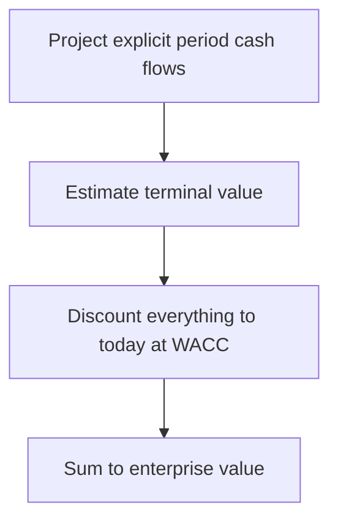

# Lecture 1 — Building a DCF

> **Duration:** ~2 hours. **Outcome:** You can turn a set of revenue, margin, capex, and working-capital assumptions into a five-year unlevered free cash flow forecast, terminate it, and discount the whole stream to an enterprise value — in SQL and in Python — and explain what every line in the calculation actually means.

Every DCF is the same four-step machine, no matter how complicated the business:

1. Project the cash flow the business will generate, for as many years as you can forecast with a straight face (usually 5–10).
2. Estimate a **terminal value** — the value of everything the business generates *after* your explicit forecast ends, forever.
3. Discount every explicit-period cash flow and the terminal value back to today, at the company's cost of capital.
4. Sum it all up. That sum is the **enterprise value (EV)**.


*The four-step DCF machine, from forecast to enterprise value.*

This lecture builds all four steps for **Crunch Machine Co.**, using the `valuation_assumptions` and `revenue_forecast` tables from this week's [README](../README.md). Read Section 1 slowly — it's the one idea (unlevered free cash flow) that the entire rest of the week is built on top of.

## 1. Unlevered free cash flow — what, and why "unlevered"

A DCF discounts **unlevered free cash flow (UFCF)** — the cash the *business itself* generates, before any payments to or from lenders (interest, principal) and before any payments to or from equity holders (dividends, buybacks). "Unlevered" means "before the effect of leverage (debt) is applied."

Why strip out debt entirely? Because you're about to discount at **WACC** — a blended rate that already accounts for the cost of *both* debt and equity financing (Week 4). If you also subtracted interest expense from the cash flow itself, you'd be double-counting the cost of debt: once in the discount rate, once in the cash flow. Keep the numerator (cash flow) and the denominator (discount rate) on the same basis — both "before financing" — or the two errors compound into a wrong answer that doesn't even fail obviously.

The formula, built up from an income statement:

```
EBIT                              (Earnings Before Interest and Taxes — operating income)
− Taxes on EBIT (at the marginal tax rate, as if all-equity financed)
= NOPAT                            (Net Operating Profit After Tax)
+ D&A                              (depreciation & amortization — added back; it's a non-cash expense)
− Capital expenditures (Capex)     (cash actually spent on PP&E, plant, equipment)
− Increase in Net Working Capital  (cash tied up funding growth: more receivables, more inventory)
= Unlevered Free Cash Flow (UFCF)
```

Read it as: **the cash left over after the business pays its (unlevered) taxes, reinvests in the assets it needs to keep running, and funds the extra working capital growth requires** — the cash that's genuinely free to be paid out to *all* capital providers, debt and equity together, which is exactly why it gets discounted at the blended cost of all capital.


*Building unlevered free cash flow from EBIT down to UFCF.*

## 2. This week's forecast drivers

The `revenue_forecast` table doesn't hand you revenue or EBITDA directly — it gives you the **drivers** an analyst actually builds a model from:

| Driver | What it controls |
|---|---|
| `revenue_growth_rate` | Year-over-year revenue growth, applied to the prior year's revenue |
| `ebitda_margin` | EBITDA as a % of that year's revenue |
| `da_pct_revenue` | D&A as a % of that year's revenue |
| `capex_pct_revenue` | Capex as a % of that year's revenue |
| `nwc_pct_incremental_revenue` | The increase in net working capital, as a % of *that year's dollar increase* in revenue (not of total revenue) |

Starting from `ltm_revenue` ($210,000,000, FY2025 actual, from `valuation_assumptions`), each year's revenue compounds off the prior year:

```
Revenue_t = Revenue_(t-1) × (1 + growth_rate_t)
```

FY2026: `210,000,000 × 1.08 = 226,800,000`. FY2027: `226,800,000 × 1.07 = 242,676,000`. And so on. Notice the **margin is expanding** over the forecast — 21.0% in 2026 rising to 23.5% by 2030 — while **capex intensity is shrinking** — 5.5% of revenue down to 3.5%. That's a specific, arguable story this model is telling: Crunch Machine Co. is investing heavily now to grow, and that investment pays off in operating leverage (more of each new revenue dollar drops to EBITDA) and a lighter reinvestment need later. Every DCF encodes a story like this whether the analyst says so out loud or not — Exercise 1 has you defend this one.

## 3. Computing the full forecast

Doing FY2026 by hand, from the drivers above and a 25% tax rate:

| Line | Calculation | Value |
|---|---|---:|
| Revenue | `210,000,000 × 1.08` | 226,800,000 |
| EBITDA | `226,800,000 × 0.210` | 47,628,000 |
| D&A | `226,800,000 × 0.04` | 9,072,000 |
| EBIT | `47,628,000 − 9,072,000` | 38,556,000 |
| Tax on EBIT | `38,556,000 × 0.25` | 9,639,000 |
| NOPAT | `38,556,000 − 9,639,000` | 28,917,000 |
| + D&A | | 9,072,000 |
| − Capex | `226,800,000 × 0.055` | 12,474,000 |
| − Δ NWC | `(226,800,000 − 210,000,000) × 0.15` | 2,520,000 |
| **Unlevered FCF** | `28,917,000 + 9,072,000 − 12,474,000 − 2,520,000` | **22,995,000** |

Run the same mechanics forward through FY2030 (Exercise 1 has you do the full five years in SQL and Python) and you land here:

| Fiscal Year | Revenue | EBITDA | D&A | EBIT | NOPAT | Capex | Δ NWC | **Unlevered FCF** |
|---:|---:|---:|---:|---:|---:|---:|---:|---:|
| 2026 | 226,800,000 | 47,628,000 | 9,072,000 | 38,556,000 | 28,917,000 | 12,474,000 | 2,520,000 | **22,995,000** |
| 2027 | 242,676,000 | 53,388,720 | 9,707,040 | 43,681,680 | 32,761,260 | 12,133,800 | 2,381,400 | **27,953,100** |
| 2028 | 257,236,560 | 57,878,226 | 10,289,462 | 47,588,764 | 35,691,573 | 11,575,645 | 2,184,084 | **32,221,306** |
| 2029 | 270,098,388 | 62,122,629 | 10,803,936 | 51,318,694 | 38,489,020 | 10,803,936 | 1,929,274 | **36,559,746** |
| 2030 | 280,902,324 | 66,012,046 | 11,236,093 | 54,775,953 | 41,081,965 | 9,831,581 | 1,620,590 | **40,865,886** |

Notice UFCF grows **much faster** than revenue across the forecast: from FY2026 to FY2030, revenue is up ~24% while unlevered FCF is up ~78% — that's the margin-expansion and capex-tapering story from Section 2 showing up directly in the cash flow. If your own numbers diverge from this table, the most common bug is applying `capex_pct_revenue` or `da_pct_revenue` to the *prior* year's revenue instead of the current year's, or computing `Δ NWC` off total revenue instead of the *increase* in revenue.

## 4. Computing the forecast in SQL

Because `revenue_forecast` only has drivers, you need a running product for compounded revenue. A recursive CTE (or, more simply, a window function with `EXP(SUM(LN(...)))`) computes it in one pass:

```sql
WITH RECURSIVE compounded AS (
    -- Anchor: FY2026, compounding off ltm_revenue
    SELECT
        rf.fiscal_year,
        va.ltm_revenue * (1 + rf.revenue_growth_rate) AS revenue,
        va.ltm_revenue AS prior_revenue,
        rf.ebitda_margin, rf.da_pct_revenue, rf.capex_pct_revenue, rf.nwc_pct_incremental_revenue
    FROM revenue_forecast rf
    CROSS JOIN valuation_assumptions va
    WHERE rf.fiscal_year = 2026

    UNION ALL

    -- Recursive step: each later year compounds off the previous computed row
    SELECT
        rf.fiscal_year,
        c.revenue * (1 + rf.revenue_growth_rate) AS revenue,
        c.revenue AS prior_revenue,
        rf.ebitda_margin, rf.da_pct_revenue, rf.capex_pct_revenue, rf.nwc_pct_incremental_revenue
    FROM compounded c
    JOIN revenue_forecast rf ON rf.fiscal_year = c.fiscal_year + 1
)
SELECT
    fiscal_year,
    ROUND(revenue, 2)                                                   AS revenue,
    ROUND(revenue * ebitda_margin, 2)                                   AS ebitda,
    ROUND(revenue * da_pct_revenue, 2)                                  AS da,
    ROUND(revenue * ebitda_margin - revenue * da_pct_revenue, 2)        AS ebit,
    ROUND((revenue * ebitda_margin - revenue * da_pct_revenue) * 0.75, 2) AS nopat,   -- ×(1 − 25% tax)
    ROUND(revenue * capex_pct_revenue, 2)                               AS capex,
    ROUND((revenue - prior_revenue) * nwc_pct_incremental_revenue, 2)   AS delta_nwc
FROM compounded
ORDER BY fiscal_year;
```

`RECURSIVE` CTEs work unchanged on both PostgreSQL and SQLite (SQLite has supported `WITH RECURSIVE` since 3.8.3). The recursive step is what makes each year's revenue depend on the *computed* prior year, not a stored one — exactly what a real revenue build needs when growth rates change year to year.

## 5. Computing the forecast in Python

The same logic, without needing recursion — a plain loop is clearer in pandas:

```python
import pandas as pd

drivers = pd.read_sql("SELECT * FROM revenue_forecast ORDER BY fiscal_year;", engine)
ltm_revenue = 210_000_000
tax_rate = 0.25

rows = []
prior_revenue = ltm_revenue
for _, d in drivers.iterrows():
    revenue = prior_revenue * (1 + d["revenue_growth_rate"])
    ebitda = revenue * d["ebitda_margin"]
    da = revenue * d["da_pct_revenue"]
    ebit = ebitda - da
    nopat = ebit * (1 - tax_rate)
    capex = revenue * d["capex_pct_revenue"]
    delta_nwc = (revenue - prior_revenue) * d["nwc_pct_incremental_revenue"]
    ufcf = nopat + da - capex - delta_nwc
    rows.append(dict(fiscal_year=int(d["fiscal_year"]), revenue=revenue, ebitda=ebitda,
                      da=da, ebit=ebit, nopat=nopat, capex=capex,
                      delta_nwc=delta_nwc, ufcf=ufcf))
    prior_revenue = revenue

forecast = pd.DataFrame(rows)
print(forecast.round(0).to_string(index=False))
```

This reproduces the table in Section 3 exactly. Keep `forecast` around — Section 6 discounts it.

## 6. Discounting the explicit period

Each year's UFCF discounts back to today at `WACC = 9.2%`, using the ordinary discount factor from Week 1: `1 / (1 + WACC)^t`, where `t` counts years from the valuation date (`t=1` for FY2026, since it's the first full forecast year after 2025 year-end).

| Year | t | UFCF | Discount factor `1/(1.092)^t` | PV of UFCF |
|---:|---:|---:|---:|---:|
| 2026 | 1 | 22,995,000 | 0.9158 | 21,057,692 |
| 2027 | 2 | 27,953,100 | 0.8386 | 23,441,462 |
| 2028 | 3 | 32,221,306 | 0.7679 | 24,744,303 |
| 2029 | 4 | 36,559,746 | 0.7032 | 25,710,624 |
| 2030 | 5 | 40,865,886 | 0.6440 | 26,317,688 |
| | | | **Sum** | **≈ 121,271,769** |

That sum — **≈$121.3M** — is the present value of everything the business earns over the next five years. It is **not** the enterprise value yet: it says nothing about what the business is worth for the rest of its life *after* 2030. That's the terminal value, and it is usually the majority of a DCF's total value — which is exactly why Section 7 and Lecture "Terminal value methods" (Exercise 2) treat it with so much care.

## 7. Terminal value — the majority of the answer, in one paragraph

Two independent methods, both covered in depth in Exercise 2:

- **Perpetuity growth (Gordon growth):** assume UFCF grows at a constant rate `g` forever after the explicit period, and value that infinite growing stream with the growing-perpetuity formula: `TV = FCF_(n+1) / (WACC − g)`. Using `g = 2.5%`: `FCF_2031 = 40,865,886 × 1.025 ≈ 41,887,533`, so `TV = 41,887,533 / (0.092 − 0.025) ≈ 625,187,064`.
- **Exit multiple:** assume the business is sold at the end of the forecast for a market-based multiple of its terminal-year EBITDA — here, `8.0× EBITDA_2030`: `TV = 66,012,046 × 8.0 ≈ 528,096,368`.

Both numbers are as of **the end of FY2030** — they still need to be discounted back 5 years at WACC before they can be added to Section 6's sum. Using the perpetuity-growth TV: `PV(TV) = 625,187,064 × 0.6440 ≈ 402,621,341`. Adding Section 6's sum: **Enterprise Value ≈ 121,271,769 + 402,621,341 ≈ $523,893,110.**

Notice how much of that total came from the terminal value alone: **≈77%** (`402.6M / 523.9M`). This is normal, not a red flag — it's a direct consequence of discounting a *finite* 5-year window against an *infinite* remaining life. It's also exactly why Exercise 2 makes you compute TV a second, independent way and cross-check the two: a number responsible for three-quarters of your answer deserves more scrutiny than any other single assumption in the model, and one method alone is thin evidence for a number that size.

## 8. Why enterprise value, not equity value, comes out of a DCF

The discount rate (WACC) blends the required return of *both* debt and equity holders, and the cash flow (UFCF) is measured *before* any payment to either — so the number you get out is the value of the whole business's operations, available to be split between all capital providers. That is **enterprise value**, not equity value. Getting from EV to a per-share price requires one more step — subtracting net debt and dividing by share count — which is the entire subject of Lecture 3's EV-to-equity bridge. Do not skip that step and report EV as if it were a stock price; it is routinely off by tens of dollars per share for a leveraged company.

## 9. Common mistakes

- **Discounting levered free cash flow (after interest) at WACC.** WACC already prices in the cost of debt; subtracting interest from the cash flow too double-counts it. If a cash flow has interest expense subtracted, discount it at the cost of *equity* alone, not WACC — that's a different, less common DCF variant (levered/equity DCF) this course doesn't build.
- **Forgetting to discount the terminal value back to today.** `TV` is a *future* value, calculated as of the end of the explicit period — it needs the same `1/(1+WACC)^n` discount factor as the final year's cash flow, not `n+1`.
- **Applying `capex_pct_revenue` or `nwc_pct_incremental_revenue` to the wrong year's revenue** — always the *current* forecast year for capex and margins; always the *increase* over the prior year for the NWC driver, never total revenue.
- **Treating the terminal value as a minor detail.** As Section 7 showed, it's routinely 60–80% of total enterprise value in a mature-growth business — it deserves as much scrutiny as the entire explicit-period forecast combined.

## 10. Check yourself

- Write the unlevered free cash flow formula from memory, and explain in one sentence why interest expense never appears in it.
- Why must the discount rate and the cash flow be on the same "levered/unlevered" basis?
- What does `revenue_forecast`'s `nwc_pct_incremental_revenue` get multiplied by — total revenue, or the *change* in revenue? Why does that distinction matter?
- Roughly what fraction of this week's DCF enterprise value came from the terminal value alone? Is that normal?
- What number comes out of a standard unlevered DCF — enterprise value or equity value — and what's still missing before you can quote a per-share price?

Lecture 2 turns from "build the value up from a forecast" to the opposite approach — reading the value the market has *already* assigned to comparable businesses — and Lecture 3 reconciles the two into one number.

## Further reading

- **Damodaran (NYU Stern) — "DCF Valuation: The Steps":** <https://pages.stern.nyu.edu/~adamodar/New_Home_Page/valuation/dcf.htm>
- **Investopedia — "Discounted Cash Flow (DCF)":** <https://www.investopedia.com/terms/d/dcf.asp>
- **Investopedia — "Unlevered Free Cash Flow":** <https://www.investopedia.com/terms/u/unlevered-free-cash-flow-ufcf.asp>
- **PostgreSQL — Recursive Queries (`WITH RECURSIVE`):** <https://www.postgresql.org/docs/current/queries-with.html#QUERIES-WITH-RECURSIVE>
- **SQLite — Common Table Expressions:** <https://www.sqlite.org/lang_with.html>
