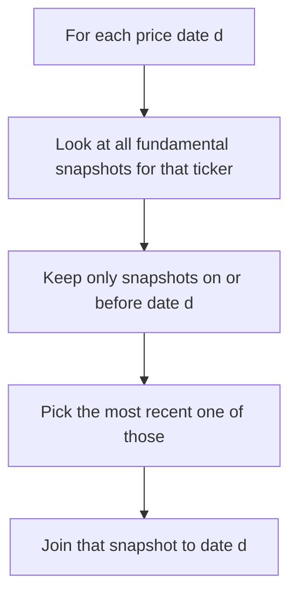
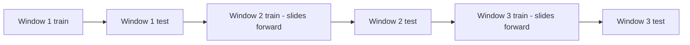

# Lecture 3 — Overfitting and Honesty

> **Duration:** ~2 hours. **Outcome:** You can name and detect look-ahead bias in a backtest, explain why an in-sample-only backtest is close to worthless as evidence of a real edge, and design a train/test or walk-forward split that gives a strategy an honest chance to fail before you trust it with capital.

Here is the uncomfortable truth this whole course has been building toward: **it is almost always possible to find a rule that would have made money on data you already have.** With seven tickers and two years of daily prices, you have enough combinations of lookback windows, thresholds, and rebalance frequencies that *some* combination will, by pure chance, have produced an attractive-looking return series — with no real, repeatable edge behind it at all. The discipline that separates a real quantitative strategy from an elaborate coincidence is entirely in this lecture. Skip it, and everything in Lectures 1–2 is a machine for fooling yourself with extra steps.

## 1. Look-ahead bias — using information before it existed

**Look-ahead bias** is the single most common and most damaging backtesting error: letting the strategy, on any given date, see data that would not actually have been available to a trader on that date. It's damaging precisely because it's invisible in the code that computes the *return* — the bug lives in the code that computes the *signal*, one or two steps upstream, and the backtest engine faithfully reports a great result built on a false premise.

**Example 1 — same-day return.** You saw the fix for this in Lecture 2: `weights.shift(1) * daily_rets`. Without the `.shift(1)`, the code implicitly assumes you traded at this morning's price using information you could only have from tonight's close. This is the classic, textbook version of the bug, and it's why the fix is baked directly into last lecture's engine.

**Example 2 — the stale fundamentals join.** This week's `fundamental_snapshot` table has exactly one date: `2025-12-31`. Consider this query, which looks completely innocent:

```sql
-- Looks fine. Isn't.
SELECT p.ticker, p.price_date, p.close_price, f.ev_ebitda
FROM daily_prices p
JOIN fundamental_snapshot f ON f.ticker = p.ticker
ORDER BY p.price_date;
```

This join has no date condition on `f.as_of_date` at all — it attaches the `2025-12-31` EV/EBITDA multiple to *every single price row back to January 2024*, including dates almost two full years before that multiple was ever computed. A value signal built from this join and traded starting in, say, March 2024, is silently using late-2025 fundamentals to make a March 2024 decision — information that, in March 2024, did not exist. This is exactly Challenge 2's bug, and it is exactly the kind of error that survives code review, because the SQL is syntactically perfect and the join condition (`ticker = ticker`) looks completely reasonable at a glance. **The bug is not in the syntax. It's in the missing time dimension.**

The honest fix, in a codebase with only one snapshot date, is to restrict any backtest using the value factor to dates on or after the snapshot's `as_of_date` — which, uncomfortably, leaves you almost nothing to test on this week, and is exactly the point: **a signal you can't honestly test is not a signal you can honestly trade.** A production system solves this properly with a full **point-in-time fundamentals table** — one row per `(ticker, filing_date, ...)` for every historical earnings release — and joins on `filing_date <= price_date` (picking the most recent filing as of each price date), never on ticker alone.


*The point-in-time-correct join: only fundamentals that existed as of the price date are allowed to inform it.*

```sql
-- The point-in-time-correct shape of a fundamentals join, for when
-- you have more than one snapshot date (a real production dataset would):
SELECT p.ticker, p.price_date, p.close_price, f.ev_ebitda, f.as_of_date
FROM daily_prices p
JOIN fundamental_snapshot f
  ON f.ticker = p.ticker
 AND f.as_of_date = (
       SELECT MAX(f2.as_of_date)
       FROM fundamental_snapshot f2
       WHERE f2.ticker = p.ticker AND f2.as_of_date <= p.price_date
     )
ORDER BY p.price_date;
```

**Example 3 — survivorship bias.** A subtler cousin of look-ahead bias: if your universe of "the seven industrial machinery names" was selected *today*, using today's knowledge of which companies are still around and successful, you've silently excluded every company that went bankrupt or got delisted along the way. A momentum strategy tested only on survivors looks better than momentum actually performed, because the biggest momentum *losers* — the ones that kept falling until they disappeared — were never in the test at all. This week's seven-ticker universe is fixed and small on purpose (for tractability), but a real research process defines its universe *as of the start date*, not with hindsight.

## 2. Overfitting — when the strategy learned the noise, not the signal

**Overfitting** happens when you tune a strategy's parameters (lookback window, threshold, top-N, rebalance frequency) *against the same data you're using to evaluate it*, until performance looks great — and what you've actually done is fit the strategy to the random noise specific to that exact sample, not to a real, repeatable pattern. The tell-tale sign: a strategy with 6 tunable parameters, tested on 2 years of data for 7 stocks, has an enormous number of degrees of freedom relative to the amount of real information in the sample. Somewhere in that search space, a combination exists that performs spectacularly — by chance alone — even if the true underlying data-generating process has no exploitable pattern at all.

A blunt way to feel this: if you tried 50 different lookback windows (5-day through 250-day momentum) and reported only the best one's Sharpe ratio, you have not found "the best momentum window." You have run 50 coin-flip experiments and reported the luckiest one. This is sometimes called **backtest overfitting** or, more colorfully, **p-hacking** — the finance-specific version of a well-known statistical sin.

The core discipline against overfitting is simple to state and hard to practice: **decide your rules before you look at how they perform, and evaluate them on data you did not use to decide.** That second half is the subject of the rest of this lecture.

## 3. Train/test splits — holding out data honestly

The most basic defense: split your history into two non-overlapping windows.

- **Training (in-sample) window** — where you're allowed to look at performance, compare variants, and choose parameters.
- **Test (out-of-sample) window** — where you commit to the parameters chosen in training and look *once*, at the very end, with no further tuning allowed.

```python
import pandas as pd

def train_test_split_by_date(df: pd.DataFrame, date_col: str, split_date: str):
    train = df[df[date_col] < split_date].copy()
    test = df[df[date_col] >= split_date].copy()
    return train, test

# Two years of data: train on 2024, test on 2025.
train, test = train_test_split_by_date(prices, "price_date", "2025-01-01")
```

With this week's dataset — 2024–2025 — a natural split is **train on 2024, test on 2025**: pick your momentum lookback, top-N, and rebalance frequency using only 2024 performance, then run the *exact same, frozen* strategy on 2025 and report whatever Sharpe and drawdown come out, good or bad. If the strategy's 2025 Sharpe ratio is dramatically worse than its 2024 Sharpe ratio, that's not bad luck to explain away — that's the test doing its job and telling you the 2024 result was mostly noise.

**The one rule that makes this whole exercise worthless if broken:** once you've looked at the test-window result, you can't go back and adjust the strategy, then re-test on the *same* test window — that just turns your "test" set into a second, disguised training set. If you need to iterate further, you need fresh out-of-sample data you haven't touched yet, which is exactly the scarce resource walk-forward validation (next) is built to conserve.

## 4. Walk-forward validation — rolling the split through time

A single train/test split gives you one out-of-sample verdict from one particular market regime (2025, in our case, might happen to be a smooth uptrend or a choppy year — either way, it's one sample). **Walk-forward validation** rolls the split through time repeatedly: train on window 1, test on window 2; then slide forward — train on windows 1–2, test on window 3; and so on — producing *several* independent out-of-sample verdicts instead of one.


*Walk-forward validation rolls the train and test windows through time, producing several independent out-of-sample verdicts instead of one.*

```python
import pandas as pd

def walk_forward_windows(dates: pd.DatetimeIndex, train_months: int = 6, test_months: int = 3):
    """Yields (train_start, train_end, test_start, test_end) rolling forward
    by `test_months` each step, so every test window is used exactly once."""
    start = dates.min()
    end = dates.max()
    cursor = start
    windows = []
    while True:
        train_start = cursor
        train_end = train_start + pd.DateOffset(months=train_months)
        test_start = train_end
        test_end = test_start + pd.DateOffset(months=test_months)
        if test_end > end:
            break
        windows.append((train_start, train_end, test_start, test_end))
        cursor = cursor + pd.DateOffset(months=test_months)
    return windows
```

Over 24 months with a 6-month train / 3-month test roll, this produces roughly six independent out-of-sample test windows. A strategy with a real edge should show a **positive, roughly consistent** net return across most of those windows. A strategy that was overfit to noise typically shows wildly inconsistent out-of-sample windows — great in some, badly negative in others — because whatever pattern it "learned" in training was specific to that training window and didn't generalize. Challenge 1 has you build and run exactly this.

## 5. Reading a backtest report skeptically — a checklist

When you (or anyone) shows you a backtest result, before you believe a single number, ask:

- **Costs:** Is this the gross return or the net-of-costs return? What cost assumption was used, and is it realistic for the strategy's turnover and the stocks' liquidity?
- **Sample:** How much history, how many independent bets? Two years of monthly rebalancing on seven names is 24 rebalance events — a small sample by statistical standards, and this week's numbers should be read with that humility.
- **Degrees of freedom:** How many parameters were tuned, and against what data? A five-parameter strategy tuned against the same two years it's being shown on tells you almost nothing.
- **Out-of-sample:** Was there a genuine, frozen-before-you-looked test window? Or is "backtest" doing double duty as both the design process and the evidence?
- **Survivorship:** Was the universe selected with hindsight (today's winners) or fixed as of the start date?
- **Regime:** Does the tested period include both up and down markets, or only one flavor?

A backtest that survives every item on that checklist is still not a guarantee of future performance — markets change, and a real edge can decay or disappear for reasons that have nothing to do with your methodology. But a backtest that fails several items on that checklist is not evidence of anything at all, no matter how good the headline Sharpe ratio looks.

## 6. Check yourself

- In your own words: what makes Example 2's fundamentals join a look-ahead bug, even though the SQL syntax is correct?
- What's the difference between look-ahead bias and survivorship bias?
- Why is testing 50 lookback windows and reporting only the best one a form of statistical malpractice, even if every individual backtest was computed correctly?
- What is the one rule that, if broken, turns a test set back into a training set?
- Why does walk-forward validation give you more confidence than a single train/test split?
- Name three items from the "reading a backtest skeptically" checklist and explain what a failure on each one would mean.

You now have the full toolkit — signal, engine, and honesty — for this week's exercises, challenges, and mini-project. Build the strategy, cost it honestly, and then try, in good faith, to prove it's real.

## Further reading

- **Bailey, Borwein, López de Prado & Zhu (2014), "Pseudo-Mathematics and Financial Charlatanism: The Effects of Backtest Overfitting on Out-of-Sample Performance"** — the canonical paper on this exact problem: <https://papers.ssrn.com/sol3/papers.cfm?abstract_id=2308659>
- **López de Prado, "Advances in Financial Machine Learning"** — Chapter 11 ("The Dangers of Backtesting") is the deepest treatment of this lecture's material available anywhere, at any level: publisher page <https://www.wiley.com/en-us/Advances+in+Financial+Machine+Learning-p-9781119482086>
- **CFA Institute, "Backtesting" (overview, free):** <https://www.cfainstitute.org/en/research/foundation>
- **scikit-learn — "Cross-validation: evaluating estimator performance"** (the general statistical-learning version of train/test and walk-forward splits): <https://scikit-learn.org/stable/modules/cross_validation.html>
