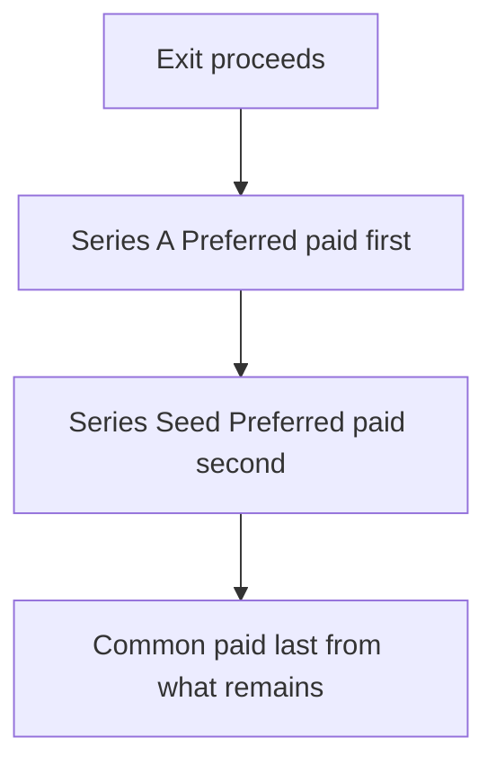
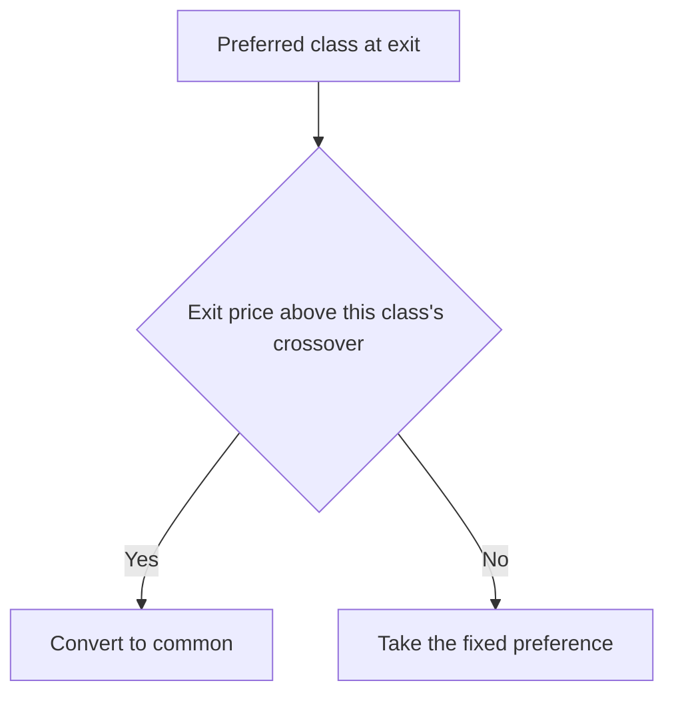

# Lecture 3 — The Exit Waterfall

> **Duration:** ~1 hour. **Outcome:** You can build a liquidation-preference stack, determine which preferred classes convert to common at a given exit price versus which take their fixed preference, and compute the actual dollars each shareholder receives.

Fully diluted ownership percentage answers "what fraction of the company do I own?" It does **not** answer "how much money do I get if the company sells?" — because preferred stock almost always carries a **liquidation preference**: a contractual right to get paid a fixed amount *before* common stock sees a dollar, regardless of what percentage the preferred holder's shares represent. This lecture is where the cap table you built across Lectures 1 and 2 finally answers the question everyone actually cares about: at exit, who gets what?

## 1. Liquidation preference — the fixed floor

A **1x non-participating liquidation preference** — the standard, market-normal term for a Series A or seed round — means: at exit, that preferred holder gets **the greater of** (a) their original investment back, or (b) what they'd get if they converted their preferred shares into common and took their pro-rata slice like everyone else. They pick whichever number is bigger. They don't get both — "non-participating" is precisely the word for "you don't get your preference *and* your pro-rata share; you get the better of the two."

Solstice's post-Series-A cap table carries two preference classes, ranked by **seniority** — newer money is senior, standard "last money in, first money out":

| Class | Holders | Shares | Preference amount | Seniority |
|-------|---------|-------:|-------------------:|-----------|
| Series A Preferred | Meridian Ventures | 3,312,500 | $5,000,000 | Senior (paid first) |
| Series Seed Preferred | Basecamp, Priya, Tom (converted SAFEs) | 653,000 | $664,000 | Junior to A, senior to common |
| Common | Maya, Diego, Option Pool (fully allocated by exit) | 12,650,000 | — (no preference) | Residual — paid last |

The **preference amount** for Series Seed is $664,000 — the sum of what those three investors actually wrote checks for ($500,000 + $100,000 + $64,000), *not* their share count times any per-share price. A liquidation preference is a claim on cash equal to the money put in (times the multiple — 1x here), independent of how many shares that money bought.


*Proceeds pay out strictly in seniority order before any residual splits by share count.*

```sql
CREATE TABLE liquidation_terms (
    security_type    TEXT PRIMARY KEY,
    preference_amount NUMERIC NOT NULL,
    preference_multiple NUMERIC NOT NULL,   -- 1x here for both classes
    seniority_rank    INTEGER NOT NULL,     -- 1 = paid first
    participating      BOOLEAN NOT NULL
);

INSERT INTO liquidation_terms VALUES
('Preferred-SeriesA', 5000000, 1.0, 1, FALSE),
('Preferred-Seed',      664000, 1.0, 2, FALSE);
```

## 2. The convert-or-take-the-preference decision

Every non-participating preferred holder faces one test at exit: **would I get more money taking my fixed preference, or converting to common and taking my pro-rata share of the whole deal?** A quick heuristic answers it: compare the preference to that class's fully diluted percentage times the *total* exit proceeds.


*Each preferred class runs this same test independently against its own crossover price.*

```sql
-- Class-level fully diluted % and the "convert" break-even exit price for each
SELECT
    lt.security_type,
    lt.preference_amount,
    class_shares.shares,
    ROUND(class_shares.shares / 16615500.0, 6) AS fd_pct,
    ROUND(lt.preference_amount / (class_shares.shares / 16615500.0)) AS convert_above_this_exit
FROM liquidation_terms lt
JOIN (
    SELECT 'Preferred-SeriesA' AS security_type, 3312500 AS shares
    UNION ALL SELECT 'Preferred-Seed', 653000
) class_shares ON class_shares.security_type = lt.security_type;
```

```
   security_type    | preference_amount | shares  |  fd_pct  | convert_above_this_exit
----------------------+--------------------+---------+----------+--------------------------
 Preferred-SeriesA    |            5000000 | 3312500 | 0.199365 |               25,079,681
 Preferred-Seed       |             664000 |  653000 | 0.039299 |               16,896,401
```

Read the last column as a **crossover price**: below it, that class is better off taking its fixed preference; above it, converting to common wins. Notice Series Seed's crossover ($16.9M) is *lower* than Series A's ($25.1M) — Series A paid a much higher price per share for its stake, so its preference is large relative to its percentage, and it takes a bigger exit before "just take the pro-rata slice" beats the guaranteed floor. This crossover-price heuristic (evaluated once, against the full exit proceeds and each class's fully diluted %) is the teaching approximation used this week; it agrees with the exact cascading calculation below at every exit price we test, and `resources.md` links the fuller iterative method production cap-table software actually runs.

## 3. Paying out the waterfall

Once you know which classes convert and which take their preference, the payout cascades in **seniority order**: pay the most senior preference first, off the top of total proceeds; whatever remains splits pro-rata among everyone who chose to convert (or who never had a preference at all — common stock) by share count.

### Scenario A — exit at $8,000,000 (both classes take their preference)

Both $8M crossover tests fail (8M is below both $16.9M and $25.1M), so both classes take their fixed preference:

```sql
-- Series A takes $5,000,000; Seed takes $664,000; remainder splits across common (12,650,000 sh)
SELECT
    8000000 - 5000000 - 664000 AS remaining_for_common,
    ROUND((8000000 - 5000000 - 664000) / 12650000.0, 6) AS common_per_share;
-- remaining_for_common = 2,336,000 | common_per_share ≈ 0.184664
```

| Holder | Shares | Payout |
|--------|-------:|-------:|
| Meridian (Series A) | 3,312,500 | $5,000,000 (preference) |
| Basecamp + Priya + Tom (Seed) | 653,000 | $664,000 (preference) |
| Maya Chen | 5,500,000 | ≈ $1,015,652 |
| Diego Ruiz | 4,500,000 | ≈ $830,988 |
| Option Pool | 2,650,000 | ≈ $489,360 |

At a modest exit, both preference classes are better off with their floor — and the founders, who own the most common stock, absorb the shortfall from the residual pool. This is exactly what a liquidation preference is *for*: it protects investor downside at the founders' expense in a disappointing outcome.

### Scenario B — exit at $20,000,000 (mixed: Series A takes preference, Seed converts)

$20M clears Seed's $16.9M crossover but not Series A's $25.1M crossover — a genuine mixed outcome:

```sql
-- Series A takes its $5,000,000 preference off the top.
-- Everyone else (Seed, converted, + common) splits the $15,000,000 remainder pro-rata by share count.
SELECT
    20000000 - 5000000 AS remaining,
    653000 + 12650000 AS converted_plus_common_shares,
    ROUND((20000000 - 5000000) / (653000 + 12650000.0), 6) AS per_share;
-- remaining = 15,000,000 | shares = 13,303,000 | per_share ≈ 1.127565
```

| Holder | Shares | Payout |
|--------|-------:|-------:|
| Meridian (Series A) | 3,312,500 | $5,000,000 (preference) |
| Basecamp + Priya + Tom (Seed, **converted**) | 653,000 | ≈ $736,320 |
| Maya Chen | 5,500,000 | ≈ $6,201,608 |
| Diego Ruiz | 4,500,000 | ≈ $5,074,043 |
| Option Pool | 2,650,000 | ≈ $2,988,046 |

Seed's decision to convert paid off — $736,320 beats their $664,000 floor. Series A still took the fixed $5,000,000 rather than the ≈$3.99M their 19.94% would have gotten from the full $20M — the preference is still the better deal for them here.

### Scenario C — exit at $100,000,000 (high: everyone converts)

$100M clears both crossovers, so **nobody** takes a preference — every class converts to common and the whole exit splits purely pro-rata across all 16,615,500 fully diluted shares, at ≈$6.0184/share:

| Holder | Shares | Payout |
|--------|-------:|-------:|
| Maya Chen | 5,500,000 | ≈ $33,101,000 |
| Diego Ruiz | 4,500,000 | ≈ $27,083,000 |
| Meridian (Series A) | 3,312,500 | ≈ $19,936,000 |
| Option Pool | 2,650,000 | ≈ $15,949,000 |
| Basecamp Seed Fund | 500,000 | ≈ $3,009,000 |
| Priya Anand | 100,000 | ≈ $602,000 |
| Tom Fischer | 53,000 | ≈ $319,000 |

At a large enough exit, liquidation preferences stop mattering entirely — everyone is better off converting, and the waterfall collapses to a pure fully-diluted pro-rata split. This is the entire arc of a liquidation preference in one sentence: **it's downside insurance for investors that becomes irrelevant the better the company does.**

## 4. Participating preferred — the other shape

Solstice's terms are all **non-participating** (the market-standard, founder-friendly shape). A **participating** preferred holder gets their fixed preference **and then also** shares pro-rata in whatever's left — "double-dipping," from the founders' perspective. Participating preferred was common in the early 2000s and is rare in healthy markets today, but you'll still meet it, especially in later or distressed rounds. The mechanical difference is one word in the query: a participating holder never faces the convert-or-take-preference test at all — they always take the preference *and* join the residual pool. Challenge 2 has you build both versions side by side and see exactly how many dollars founders lose to a participating term at the same exit price.

## 5. Check yourself

- What does "1x non-participating" mean, in one sentence?
- Why is a class's crossover exit price *lower* when its preference amount is small relative to its fully diluted percentage?
- At an $8M exit, why do the founders bear the entire shortfall between total proceeds and the preferences paid out?
- In Scenario C, why does nobody take their liquidation preference?
- What's the one mechanical difference between a participating and a non-participating preferred holder's payout?

That closes the core content for Week 11. The exercises rebuild each of these three lectures' mechanics from a blank table so they're in your hands, not just on this page; the challenges push the waterfall and a second financing round further than the lecture did; the mini-project runs the entire founding-to-exit arc end to end.

## Further reading

- **Carta — "Liquidation preferences explained":** <https://carta.com/learn/startups/equity-management/liquidation-preference/>
- **NVCA — Model Certificate of Incorporation (liquidation preference language):** <https://nvca.org/model-legal-documents/>
- **Fenwick & West — "Participating vs. non-participating preferred":** <https://www.fenwick.com/insights>
