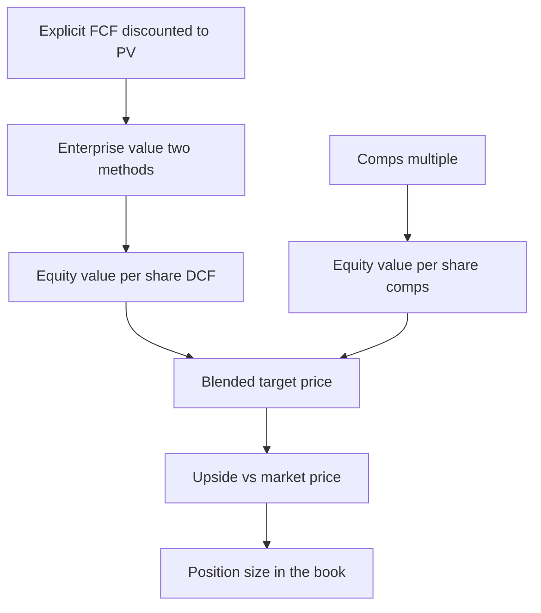

# The end-to-end deal — stitching valuation, financing, and allocation into one coherent investment case

> **Duration:** ~2 hours. **Outcome:** You can take a target company's cash-flow stream, comps multiple, and market price and produce one reconciled valuation range, translate that range into a conviction-weighted position size inside an existing portfolio, and trace every number in the chain back to the query or calculation that produced it.

Eleven weeks of this course have each handed you one clean, isolated tool: discount a cash flow, price a WACC, value a company, optimize a portfolio, backtest a rule. Real capital allocation almost never asks you to use exactly one of those tools in isolation. It asks you to use all of them, in sequence, on the same target, and to notice where they disagree with each other — because that disagreement is where the actual judgment call lives. This lecture is about the **stitching**, not any single tool. By the end you'll have taken `capstone_cash_flows`, `capstone_deal_snapshot`, and `capstone_portfolio_context` and turned them into a single recommendation: buy CRNM, size it at X% of the book, here's why.

## 1. Recap: the pieces you already have

Everything this week needs already exists in the database, computed the same way you computed it in earlier weeks:

| Piece | Table | What it is | Where you built the method |
|---|---|---|---|
| Cash-flow stream | `capstone_cash_flows` | 5 years of unlevered FCF, already derived from drivers | Week 7, Lecture 1 |
| Deal snapshot | `capstone_deal_snapshot` | WACC, terminal assumptions, capital structure, comps multiple, market price | Week 4 (WACC) + Week 7 (comps) |
| Portfolio context | `capstone_portfolio_context` | The existing six-fund core book plus a proposed CRNM weight | Week 8 |

The discipline this week teaches is **not re-deriving any of this from scratch** — it's correctly *assembling* pieces that already exist, the way a real analyst inherits a partially-built model from last quarter's work and has to trust (and verify) it rather than rebuild it. Verification matters: before you build on any inherited number, run the sanity checks from the README and spot-check one row of `capstone_cash_flows` against the growth/margin logic described there.

## 2. Discounting the stream to an enterprise value

Two things happen here, both familiar from Week 7: discount five years of explicit cash flow, then add a terminal value computed two independent ways.

```sql
-- Present value of each year's unlevered FCF, discounted at WACC
SELECT
    fiscal_year,
    unlevered_fcf,
    unlevered_fcf / POWER(1 + d.wacc, fiscal_year - 2025) AS pv_fcf
FROM capstone_cash_flows cf
CROSS JOIN capstone_deal_snapshot d
ORDER BY fiscal_year;
```

Sum that column and you have the present value of the explicit forecast period — **$121.3M**. That number alone is not the enterprise value; a five-year forecast is a small fraction of a going concern's true life. The rest of the value lives in the **terminal value**: what the business is worth at the end of year 5, discounted back to today.

**Perpetuity growth method** — treat year-6-onward FCF as a growing perpetuity:

```
TV_2030 = FCF_2030 × (1 + g) / (WACC − g)
        = 40,865,886 × 1.025 / (0.092 − 0.025)
        = 41,887,533 / 0.067
        ≈ $625.2M
```

**Exit multiple method** — assume the business sells for the same EV/EBITDA multiple as today's peer set applied to year-5 EBITDA:

```
TV_2030 = EBITDA_2030 × exit_multiple
        = 66,012,046 × 8.0
        ≈ $528.1M
```

Discount each terminal value back five years at WACC and add it to the $121.3M explicit-period PV:

| Method | PV of terminal value | + PV of explicit FCF | = Enterprise value |
|---|---:|---:|---:|
| Perpetuity growth | $402.7M | $121.3M | **≈ $524.0M** |
| Exit multiple | $340.1M | $121.3M | **≈ $461.4M** |

The **$62.6M gap between the two methods** is not an error — it's information. It tells you the perpetuity method's 2.5% terminal growth rate is, at this WACC, worth more than the market currently pays for a peer at 8.0x EBITDA. Write that observation down; it's exactly the kind of gap an IC member will ask you to explain, and "the model said so" is not an answer.

## 3. Bridging enterprise value to a per-share price

Same EV-to-equity bridge as Week 7: subtract debt, add cash, divide by shares.

```sql
SELECT
    'Perpetuity method' AS method,
    524000000 - d.total_debt + d.cash_and_equivalents AS equity_value,
    (524000000 - d.total_debt + d.cash_and_equivalents) / d.shares_outstanding AS per_share
FROM capstone_deal_snapshot d
UNION ALL
SELECT
    'Exit multiple method',
    461400000 - d.total_debt + d.cash_and_equivalents,
    (461400000 - d.total_debt + d.cash_and_equivalents) / d.shares_outstanding
FROM capstone_deal_snapshot d;
```

Expected: **≈ $18.71/share** (perpetuity) and **≈ $16.10/share** (exit multiple). Both DCF answers sit well above the market price of **$12.50** in `capstone_deal_snapshot`.

## 4. Bringing in the comps answer

Week 7 taught you a comps analysis is a separate, independent estimate — it shouldn't be forced to agree with the DCF, and when it doesn't, that disagreement is the signal, not noise. `capstone_deal_snapshot.comps_median_ev_ebitda` (8.50x) carries forward a peer-median multiple applied to CRNM's own LTM EBITDA:

```
EV_comps = 8.50 × $43.05M ≈ $365.9M
Equity_comps = $365.9M − $110M + $35M ≈ $290.9M
Per_share_comps = $290.9M / 24M shares ≈ $12.12
```

Now you have **three independent answers**: $18.71 (DCF, perpetuity), $16.10 (DCF, exit multiple), and $12.12 (comps). The market is pricing CRNM at $12.50 — essentially in line with the comps answer, well below both DCF answers. That is the actual shape of a real valuation disagreement: the market appears to be pricing CRNM like its cyclical peers, while a DCF built on management's own growth/margin assumptions says it's worth meaningfully more. **Neither view is automatically right.** The market could be correctly discounting execution risk the DCF assumptions paper over; or the market could be under-pricing a name the sell side hasn't caught up to yet. Your job this week is not to declare a winner — it's to size a position that's honest about which scenario you're actually betting on.

## 5. Triangulating one number for the case

A defensible practice: weight the methods by how much company-specific information each one uses, and say so explicitly.

```
Blended target = 0.60 × average(DCF methods) + 0.40 × comps
               = 0.60 × average(18.71, 16.10) + 0.40 × 12.12
               = 0.60 × 17.41 + 0.40 × 12.12
               ≈ $15.29/share
```

Why 60/40 and not 50/50? Because the DCF is built on this specific company's own driver assumptions (its growth, its margins, its capex plan) while the comps answer borrows six other companies' market pricing and assumes CRNM deserves the same multiple — a weaker assumption when the company's own fundamentals are unusually strong or weak relative to peers. **This weighting choice is a judgment call, not a formula, and Challenge 1 will make you defend it.** A reasonable colleague could argue for 50/50, or for weighting comps *more* on the theory that markets are usually right and DCFs are dangerously easy to overfit toward the answer you wanted going in. State your weighting and your reasoning in every valuation you ever write — an unstated weighting is a hidden assumption.

At a blended target of **$15.29** against a market price of **$12.50**, the implied upside is:

```
(15.29 − 12.50) / 12.50 ≈ 22.3%
```

## 6. From a target price to a position size

A 22% expected upside does not, by itself, tell you how much to buy. Position sizing has to account for **conviction** (how sure are you?) and **risk budget** (how much can this position hurt the whole book if you're wrong?) — which is exactly why `capstone_portfolio_context` exists.

A simple, defensible framework — not the only one, but one you can compute and explain — scales a position by the ratio of expected edge to volatility, capped by a maximum satellite-position policy:

```python
import pandas as pd

edge = 0.223          # your computed upside, as a decimal
crnm_vol = 0.28        # capstone_portfolio_context.annual_volatility for CRNM
max_satellite_weight = 0.10   # a policy constraint: no single satellite > 10% of the book

# A crude but auditable "edge per unit of risk" scalar, scaled to a policy cap
raw_signal = edge / crnm_vol          # ≈ 0.796
proposed_weight = min(raw_signal * 0.10, max_satellite_weight)   # scale + cap
print(round(proposed_weight, 4))      # ≈ 0.0796 -> round to an 8% satellite position
```

This is deliberately simple — real shops use more sophisticated sizing (fractional Kelly, risk-parity contribution, VaR budgeting — Lecture 2 gets you there) — but the discipline is the same at every level of sophistication: **size is a function of edge AND risk, computed, not a round number picked because it "felt right."** `capstone_portfolio_context` already has an **8%** target weight for CRNM as the satellite — notice it lands almost exactly where this back-of-envelope sizing calculation does. That is not a coincidence; it's how the week's dataset was built, and it's exactly the kind of consistency check you should run on any position size you're handed: does it survive being recomputed independently?


*The end-to-end deal: cash flows and comps converge on one blended target, which becomes a sized position.*

## 7. What this position does to the existing book

With CRNM sized at 8%, the six core weights scale down proportionally to keep the book at 100%. Quick sanity math using `capstone_portfolio_context`:

```sql
SELECT ticker, role, target_weight,
       target_weight * annual_return AS weighted_return_contribution
FROM capstone_portfolio_context
ORDER BY role, target_weight DESC;
```

Sum the `weighted_return_contribution` column and you get the book's expected annual return under this allocation — a portfolio-level number, not just a single-stock one. Lecture 2 takes this further: expected return is easy to add up; **risk does not add up the same way**, because of correlation. That's where Value at Risk comes in.

## 8. Check yourself

- Why are the DCF and comps answers allowed to disagree, and what does the size of the gap tell you?
- What is the difference between the perpetuity-growth and exit-multiple terminal value methods, mechanically?
- Why is a 60/40 DCF/comps weighting a judgment call rather than a formula — and what would make you shift it to 50/50 or 40/60?
- Walk through, in words, why "22% upside" alone is not a position size.
- What does `capstone_portfolio_context.corr_with_crnm` tell you that `annual_volatility` alone cannot?

If those are automatic, Lecture 2 goes from "here's the upside" to "here's exactly how much you could lose, and under what conditions" — the other half of every real allocation decision.

## Further reading

- **CFA Institute — "Equity Asset Valuation" curriculum overview:** <https://www.cfainstitute.org/en/membership/professional-development/refresher-readings>
- **Damodaran Online — Valuation datasets and tools (NYU Stern):** <https://pages.stern.nyu.edu/~adamodar/>
- **PostgreSQL — Window functions (for building your own PV tables):** <https://www.postgresql.org/docs/current/tutorial-window.html>
