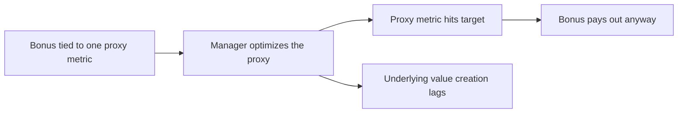
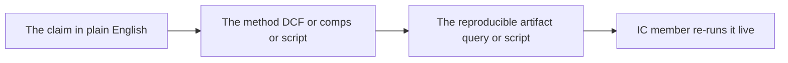

# Governance and defending the number — incentives, controls, and presenting a reproducible case that survives scrutiny

> **Duration:** ~2 hours. **Outcome:** You can recognize the incentive structures and control gaps that turn a good valuation thesis into a bad outcome, quantify — not just narrate — how a poorly-designed bonus plan would have behaved across your own scenario set, and assemble a risk memo where every number traces back to a query or script an IC member can re-run on the spot.

Every number you've built this week assumes the cash flows in `capstone_cash_flows` actually show up, that management allocates capital the way the model assumes, and that the people running the target company are trying to make the same thing happen that you are betting on. That assumption is almost never fully true, and the gap between it and reality has a name: **governance risk**. This lecture is about pricing that gap the same rigorous way you priced everything else this week — with a query, not a vibe — and then packaging the whole week into a memo that can survive someone trying to break it.

## 1. Why governance is a risk factor, not a footnote

A DCF prices *cash flows*. It says nothing about whether the people controlling those cash flows are incentivized to deliver them to shareholders, reinvest them well, or divert them elsewhere. Two companies with identical projected cash flows can be radically different investments if one has a board that will catch a problem in week one and the other has a board that meets once a year. Professional credit and equity analysis treats governance as a genuine risk factor — alongside market risk, credit risk, and operational risk — because history is full of situations where the numbers were fine and the outcome was terrible anyway, entirely because of *who controlled the numbers and what they were rewarded for doing with them*.

`capstone_governance_cases` gives you six structured, fictional-but-realistic vignettes. Query them the way you'd query any other risk dataset — patterns, not anecdotes:

```sql
SELECT industry, incentive_structure, failure_mode
FROM capstone_governance_cases
ORDER BY industry;
```

Notice the shape of every failure mode in that table: in each case, **someone was rewarded for optimizing a number that was a proxy for value creation, and they optimized the proxy instead of the value.** Revenue-only bonuses got channel-stuffed. Price-only vesting got maintenance capex deferred. That pattern — reward the proxy, get the proxy, not the goal — is the single most useful governance heuristic you'll carry out of this course. Every time you evaluate an incentive plan, ask: *what would a rational, self-interested manager do to maximize this specific metric, even if it hurt the business?* If the honest answer is "something bad," you've found a governance risk before it shows up in the financials.


*The recurring governance failure pattern: the metric gets optimized, not the goal it was meant to stand in for.*

## 2. Quantifying an incentive, not just describing it

Description is a start; **quantification is the standard this course holds you to.** Take Case 1 from `capstone_governance_cases` — a bonus plan paid on revenue growth alone — and model it against your own `capstone_scenarios` to see exactly how it would have behaved.

```python
import pandas as pd

# capstone_scenarios, loaded as a DataFrame: scenario_name, probability,
# revenue_growth_shock, ebitda_margin_shock (from the README's setup)
scenarios = pd.DataFrame({
    "scenario_name":        ["Base Case", "Recession", "Margin Compression",
                              "Multiple Re-Rating", "Stagflation", "Credit Crunch"],
    "probability":          [0.45, 0.20, 0.15, 0.10, 0.07, 0.03],
    "revenue_growth_shock": [0.000, -0.040, -0.010, 0.010, -0.020, -0.015],
    "ebitda_margin_shock":  [0.000, -0.020, -0.030, 0.005, -0.025, -0.010],
})

BASE_GROWTH = 0.08          # FY2026 base-case revenue growth from capstone_cash_flows
BASE_MARGIN = 0.21          # FY2026 base-case EBITDA margin
BONUS_TARGET_GROWTH = 0.06  # bonus pays in full at 6% revenue growth or better

scenarios["shocked_growth"] = BASE_GROWTH + scenarios["revenue_growth_shock"]
scenarios["shocked_margin"] = BASE_MARGIN + scenarios["ebitda_margin_shock"]

# Revenue-only bonus plan: pays out any year growth clears the target,
# with ZERO regard for what happened to margin/cash flow that same year
scenarios["revenue_bonus_pays"] = scenarios["shocked_growth"] >= BONUS_TARGET_GROWTH

# A better-designed bonus: pays only if growth clears target AND margin
# didn't fall more than 1pp from base case (a crude cash-flow-quality gate)
scenarios["quality_gated_bonus_pays"] = (
    (scenarios["shocked_growth"] >= BONUS_TARGET_GROWTH) &
    (scenarios["shocked_margin"] >= BASE_MARGIN - 0.01)
)

print(scenarios[["scenario_name", "probability", "shocked_growth",
                  "shocked_margin", "revenue_bonus_pays", "quality_gated_bonus_pays"]])
```

Run this and look at the **Margin Compression** row: revenue growth only dips 1pp (still clears a 6% target easily) while margin falls a full 3pp — a scenario where the business is visibly deteriorating on the metric that actually matters (profitability), yet the revenue-only bonus pays out in full. The quality-gated version correctly withholds it. You've now **quantified**, with a probability weight attached (15%), exactly how often a naively-designed incentive plan would reward management for a year that actually destroyed value. That is the difference between saying "revenue-only bonuses are bad practice" (true, but generic) and saying "under this specific scenario set, a revenue-only bonus pays out in a value-destroying year with 15% probability" (specific, quantified, and defensible in a room).

## 3. Governance risk hides in numbers you've already computed

You don't need a new dataset to start spotting governance risk in CRNM specifically — several of this week's own numbers are governance signals if you read them that way. Query `capstone_deal_snapshot` again, but this time as a leverage-and-incentive question, not a valuation question:

```sql
SELECT
    total_debt,
    ltm_ebitda,
    total_debt / ltm_ebitda AS net_leverage_multiple,
    total_debt - cash_and_equivalents AS net_debt
FROM capstone_deal_snapshot;
```

**Expected: net leverage ≈ 2.55x LTM EBITDA.** That's not an extreme number on its own, but it's a governance-relevant fact for two reasons a pure DCF read would miss entirely. First, debt at this level almost always comes with **covenants** — contractual limits on further leverage, minimum interest coverage, restrictions on dividends — that constrain what management *can* do with cash flow regardless of what the DCF assumes they'll do with it; if you haven't checked whether covenant headroom is tight, you don't actually know if the capex plan in `capstone_cash_flows` is achievable without a refinancing. Second, leverage changes *whose* interests management is actually serving under stress: near a covenant breach, a rational management team's incentive shifts from "maximize long-run equity value" toward "avoid triggering default this quarter" — sometimes at the direct expense of the long-run plan your DCF is pricing. Notice this is exactly the mechanism behind Case 2 in `capstone_governance_cases` (deferred maintenance capex to hit a price target) — leverage and incentive design compound each other, they don't act independently.

This is also why Week 5's capital-structure work and this week's governance read are not separate skills: **the leverage decision itself is a governance decision.** A capital structure with thin covenant headroom concentrates power in whoever controls the refinancing conversation, and shifts risk onto whichever stakeholders have the least contractual protection when things go wrong — usually equity holders, which is to say, you.

## 4. Controls: catching the failure before the incentive does the damage

Incentives create the *motive*; weak controls remove the *friction* that would otherwise catch the resulting behavior. `capstone_governance_cases` includes control failures alongside incentive failures — Case 3's annual-only audit committee, Case 4's concentrated CEO/Chair role. When you evaluate a target for a position, ask a short, concrete checklist, and answer each with something you can actually verify (a proxy statement, an 8-K, a board composition disclosure) rather than an assumption:

- **Board independence and structure** — is the CEO also the Chair? Is there a genuinely empowered lead independent director if so?
- **Audit and oversight cadence** — does the audit committee meet often enough to catch a problem within a quarter, not a year?
- **Related-party transactions** — are they disclosed, and reviewed by directors with no stake in the outcome?
- **Metric design** — do incentive plans reward cash/return metrics (FCF, ROIC) or gameable proxies (bookings, revenue, headline EPS)?
- **Externality coverage** — are safety, quality, or compliance failures scored anywhere in the incentive plan, or only cost and growth?

None of this replaces the valuation and risk work from Lectures 1–2. It sits **on top of it**, as a qualifier: a name that clears your valuation bar and your VaR budget but fails three items on this list should get a *smaller* position size than an identical valuation on a name that clears all five — same expected cash flows, different confidence that you'll actually receive them.

## 5. Defending the number: the reproducibility standard

Everything in this week has been building toward one professional habit: **every number in your memo has a query or a script that produced it, and you can re-run it live if someone asks.** This is not a nice-to-have — it is the actual dividing line between analysis an IC can trust and analysis it can't. A memo that says "we estimate $15.29/share" with no attached SQL or Python is a claim. The same memo with `SELECT ... FROM capstone_cash_flows ...` attached, that someone else can run against the same database and get the same $15.29, is **evidence**.

Structure every claim in your memo the same way:

1. **The claim** — one sentence, in plain English ("Our blended valuation is $15.29/share, 22% above the current market price of $12.50").
2. **The method** — one or two sentences on how you got there (DCF perpetuity + exit multiple, weighted 60% against comps at 40%).
3. **The reproducible artifact** — the actual query or script filename, so a skeptical reader can run it themselves.


*Every number in the memo carries its own receipt, from claim to method to a re-runnable artifact.*

This is exactly what separates the mini-project's deliverable from a normal essay. It's also the only real defense against your own confirmation bias: if you can't write the query that proves a claim, that's usually a sign the claim is softer than you think it is — a useful, humbling check to run on yourself *before* an IC member runs it on you.

## 6. What "defending the number" looks like under questioning

A memo isn't tested by being read quietly — it's tested by someone trying to break it out loud. Anticipate the three questions every competent IC member asks, and have the query ready before they ask it:

- **"What's your biggest assumption, and what happens if it's wrong?"** — Have the sensitivity already computed (this is Challenge 1). Never let this question be the first time you've thought about it.
- **"Show me that number."** — If you can't pull up the query in under a minute, the number isn't really yours yet.
- **"Who benefits if you're wrong?"** — This is the governance question, and it's the one most analysts aren't ready for. It's asking whether *your own* incentives (a bonus tied to hitting a target return this quarter, say) are pointed the same direction as getting the analysis right, or pointed toward talking yourself into a position that looks good on this quarter's scorecard. Answer it honestly; a good IC respects the analyst who names their own conflict before being asked.

## 7. Check yourself

- State, in one sentence, the general pattern behind every failure mode in `capstone_governance_cases`.
- Why does a "quality-gated" bonus plan behave differently from a revenue-only plan specifically in the Margin Compression scenario, and not much differently in the Base Case?
- Why is CRNM's ≈2.55x net leverage a governance signal, not just a capital-structure fact — what does it change about whose interests management is likely to serve under stress?
- Give one governance checklist item that would NOT be visible in a company's financial statements alone.
- What makes a memo claim "evidence" instead of just an assertion, in this lecture's framing?
- Why is "who benefits if you're wrong" a governance question about the analyst, not just about the target company?

You've now covered every stage of a real deal: valuation (Lecture 1), risk (Lecture 2), and governance (Lecture 3). The exercises turn all three into one artifact — a memo — and the mini-project asks you to run the whole thing on a target of your own choosing or on CRNM one more time, end to end, without a single step skipped.

## Further reading

- **OECD — "Principles of Corporate Governance":** <https://www.oecd.org/corporate/principles-corporate-governance/>
- **SEC — EDGAR full-text search (for reading real proxy statements and 8-Ks):** <https://www.sec.gov/cgi-bin/browse-edgar>
- **Cadbury Report (1992) — "Financial Aspects of Corporate Governance," the founding modern governance-code document:** <https://ecgi.global/code/cadbury-report-1992>
